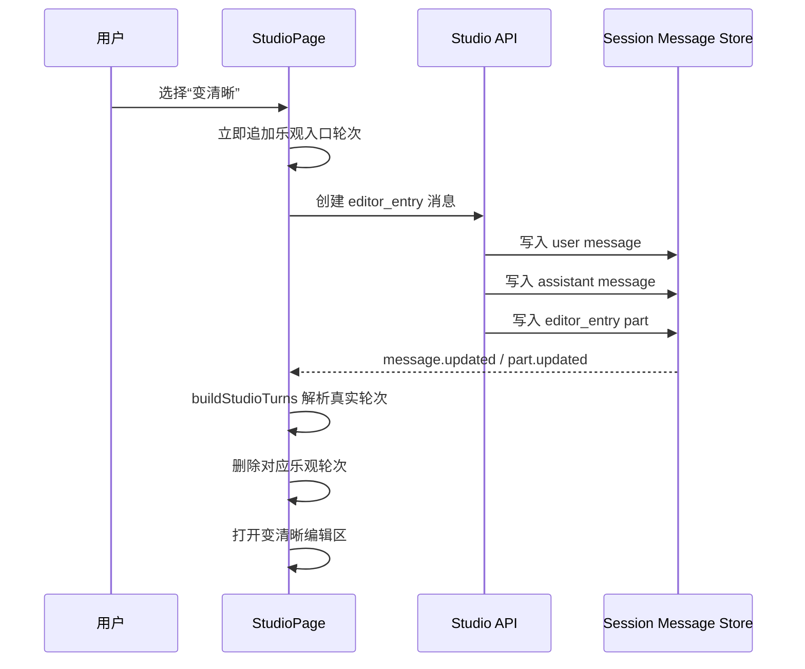

# Studio 编辑入口对话持久化方案

## 1. 背景

Studio Composer 当前支持以下图片编辑能力：

- 变清晰：`image.upscale`
- 抠图：`image.cutout`
- 智能重绘：`image.inpaint`
- 扩图：`image.outpaint`

用户从 Composer 切换到这些能力时，页面会展示一轮对话：

1. 用户消息显示对应功能名称，例如“变清晰”。
2. 助手区域显示“点击前往编辑区”。
3. 点击助手区域可重新进入对应编辑区。

当前这轮对话只存在于前端临时状态中。用户切换到其他能力后，原有轮次会被清除；刷新页面或重新进入会话后也无法恢复。

## 2. 当前实现分析

### 2.1 临时状态

`StudioPage` 使用单个 signal 保存编辑入口轮次：

```ts
const [editEntryTurn, setEditEntryTurn] = createSignal<StudioTurnData>()
```

选择编辑能力时，`createEditorEntry()` 创建临时轮次：

```ts
setEditEntryTurn({
  id: `studio_edit_${value}_${Date.now()}`,
  userText: label,
  assistantText: "点击前往编辑区",
  editCapability: value,
  createdAt: Date.now(),
  isLatest: true,
})
```

该对象没有写入 Studio session，也没有进入服务端 message/part 数据。

### 2.2 展示方式

`displayTurns()` 从 session 中解析真实轮次，然后把 `editEntryTurn` 临时追加到末尾：

```ts
const entry = editEntryTurn()
if (entry) {
  const withLatest = next.map((turn) => ({ ...turn, isLatest: false }))
  return [...withLatest, { ...entry, isLatest: true }]
}
```

因此编辑入口轮次与正常生成轮次存在两个数据来源：

- `turns()`：来自 session message/part，可重新加载。
- `editEntryTurn()`：仅存在于当前组件实例内。

### 2.3 消失原因

切换到普通生成能力时，`applyStudioCapability()` 会清空临时轮次：

```ts
batch(() => {
  setEditEntryTurn(undefined)
  setWorkspaceImage(undefined)
  setWorkspaceUploadRequested(false)
  setMode("preview")
})
```

切换到另一个编辑能力时，新的 `setEditEntryTurn()` 也会覆盖旧对象。

此外，路由参数 `params.id` 变化时也可能执行：

```ts
setEditEntryTurn(undefined)
```

所以当前实现无法支持：

- 在同一会话中保留多轮编辑入口。
- 编辑能力与生成能力来回切换后保留入口轮次。
- 刷新页面后恢复入口轮次。
- 切换历史会话后恢复入口轮次。

## 3. 修改目标

编辑入口轮次应成为 Studio 会话中的正式消息，并满足以下要求：

1. 选择编辑能力后生成一轮可持久化的用户与助手消息。
2. 切换到其他能力后，已有编辑入口轮次继续保留。
3. 连续选择多个编辑能力时，每次选择都生成独立轮次。
4. 刷新页面或重新进入会话后，轮次可以从 session 中恢复。
5. 点击任意历史入口轮次，都能进入该轮对应的编辑能力。
6. 不创建图片生成任务，不触发模型调用。
7. 不把编辑入口误解析成失败或空的图片生成结果。
8. 前端仍可乐观展示，避免等待接口期间出现明显延迟。

## 4. 总体方案

将编辑入口轮次写入现有 session message/part 存储，使其与图片、视频生成轮次共用同一套数据源。

建议流程：



服务端消息应包含：

- 一条 user message，文本为能力名称。
- 一条 assistant message。
- 一条用于识别编辑入口的结构化 part。

不需要创建 generation 记录，也不需要创建运行中的图片工具 part。

## 5. 数据结构设计

### 5.1 请求结构

新增 Studio 编辑入口请求：

```ts
type StudioEditorEntryRequest = {
  sessionID: string
  capability:
    | "image.upscale"
    | "image.cutout"
    | "image.inpaint"
    | "image.outpaint"
  entryID: string
}
```

字段说明：

- `sessionID`：入口轮次所属 Studio 会话。
- `capability`：目标编辑能力。
- `entryID`：客户端生成的幂等与乐观去重标识。

建议 `entryID` 使用：

```ts
crypto.randomUUID()
```

### 5.2 消息结构

user message 的 text part：

```json
{
  "type": "text",
  "text": "变清晰"
}
```

assistant message 的 text part：

```json
{
  "type": "text",
  "text": "点击前往编辑区"
}
```

assistant message 再附加一个结构化 part。优先复用现有可持久化的 tool part，因为当前 message/part 类型和事件链已经支持该类型：

```ts
{
  type: "tool",
  tool: "studio_editor_entry",
  callID: `studio_editor_entry_${entryID}`,
  state: {
    status: "completed",
    title: "进入变清晰编辑区",
    input: {
      capability: "image.upscale",
      entryID,
    },
    output: JSON.stringify({
      type: "editor_entry",
      capability: "image.upscale",
      entryID,
    }),
    metadata: {
      studio: {
        type: "editor_entry",
        capability: "image.upscale",
        entryID,
      },
    },
    time: {
      start: createdAt,
      end: createdAt,
    },
  },
}
```

使用结构化字段而不是根据中文文案判断能力，避免文案调整或国际化导致历史消息失效。

### 5.3 能力白名单

服务端必须限制可写入的能力：

```ts
const STUDIO_EDITOR_CAPABILITIES = new Set([
  "image.upscale",
  "image.cutout",
  "image.inpaint",
  "image.outpaint",
])
```

请求中的 capability 不在白名单时返回参数错误。

## 6. 服务端修改

### 6.1 新增接口

建议新增接口：

```text
POST /studio/editor-entries
```

请求体：

```json
{
  "sessionID": "ses_xxx",
  "capability": "image.upscale",
  "entryID": "uuid"
}
```

响应体：

```json
{
  "entryID": "uuid",
  "userMessageID": "msg_xxx",
  "assistantMessageID": "msg_xxx"
}
```

接口职责：

1. 校验 session 存在。
2. 校验 session 的 agent 为 `octo_studio`。
3. 校验 capability 属于编辑能力白名单。
4. 根据 `entryID` 做幂等检查。
5. 创建 user 和 assistant message。
6. 创建 user text、assistant text 和 editor entry tool part。
7. 更新 session 的 `time_updated`。
8.发送 `MessageV2.Event.Updated` 和 `MessageV2.Event.PartUpdated`。

### 6.2 抽取消息持久化帮助函数

当前 `studio-service.ts` 的 `persistStudioSession()` 已经包含创建 user、assistant、text part 和 tool part 的逻辑。

建议抽取公共部分，例如：

```ts
function createStudioMessagePair(input: {
  session: Session
  userText: string
  assistantText: string
  createdAt: number
}) {
  // 创建 userInfo、assistantInfo、userTextPart、assistantTextPart
}
```

生成任务继续追加 generation tool part；编辑入口追加 editor entry tool part。

这样能避免复制以下容易出错的信息：

- provider/model 信息。
- assistant 的 `parentID`。
- session directory。
- message 时间。
- agent 和 mode。
-消息事件发送顺序。

如果抽取会扩大当前修改范围，也可以第一版增加独立的 `persistStudioEditorEntry()`，但字段应与 `persistStudioSession()` 保持一致。

### 6.3 幂等处理

乐观展示和网络重试可能导致同一入口请求重复提交，因此服务端应基于 `entryID` 防重。

可选方式：

1. 在 tool part 的 `callID` 中写入 `entryID`，创建前查询已有 part。
2. 在 tool part metadata 中保存 `entryID`，创建前扫描当前 session 的相关 part。
3. 新增专门的数据表并为 `entryID` 建唯一索引。

本功能数据量较小，建议优先使用第一种方式，不新增数据库表：

```ts
callID: `studio_editor_entry_${entryID}`
```

若找到同一 `callID`，直接返回已有消息信息。

### 6.4 不进入生成任务流程

编辑入口接口不能复用 `/studio/generations`，原因是：

- 不应创建 generation 数据。
- 不应进入异步轮询。
- 不应显示“图片生成中”。
- 不应触发模型或图片服务。
- 不应影响 `pendingResult` 和 generation status。

因此应建立轻量的独立入口。

## 7. 前端解析修改

### 7.1 扩展 `buildStudioTurns()`

`buildStudioTurns()` 当前会把 user message 与后续 assistant message组合成 `StudioTurnData`。

需要在 assistant parts 中识别 editor entry part：

```ts
function parseEditorEntry(
  tools: Extract<Part, { type: "tool" }>[],
) {
  return tools
    .filter((part) => part.tool === "studio_editor_entry")
    .map((part) => {
      const metadata = part.state.metadata?.studio
      if (metadata?.type !== "editor_entry") return
      if (!isStudioEditorCapability(metadata.capability)) return
      return {
        capability: metadata.capability,
        entryID: metadata.entryID,
      }
    })
    .find(Boolean)
}
```

解析到 editor entry 后，返回：

```ts
{
  id: `studio_editor_${entryID}`,
  userText,
  assistantText,
  editCapability: capability,
  createdAt,
  isLatest: false,
}
```

编辑入口不能继续进入普通生成结果的 `buildResult()` 路径，否则 completed tool part 可能被识别为空生成结果。

建议在 `buildStudioTurns()` 中先判断：

```ts
const editorEntry = parseEditorEntry(tools)
if (editorEntry) {
  return buildEditorEntryTurn(...)
}
return buildResult(...)
```

### 7.2 文案兼容

展示层应优先使用消息中的文本：

- `userText` 来自 user text part。
- 按钮固定展示“点击前往编辑区”，或者使用 assistant text。

能力识别只依赖结构化 metadata。

如果历史消息中只有 metadata 而 text 缺失，可以使用 `capabilityLabel()` 作为 fallback。

## 8. 前端状态修改

### 8.1 替换单个 `editEntryTurn`

不再使用单个：

```ts
const [editEntryTurn, setEditEntryTurn] = createSignal<StudioTurnData>()
```

改为仅保存接口确认前的乐观轮次：

```ts
const [pendingEditorEntries, setPendingEditorEntries] =
  createSignal<StudioTurnData[]>([])
```

该数组不是历史记录的正式来源，只负责覆盖接口响应前的短暂时间。

### 8.2 乐观轮次结构

选择编辑能力时先创建：

```ts
const entryID = crypto.randomUUID()
const optimisticTurn = {
  id: `studio_editor_pending_${entryID}`,
  userText: capabilityLabel(value),
  assistantText: "点击前往编辑区",
  editCapability: value,
  createdAt: Date.now(),
  isLatest: true,
  editorEntryID: entryID,
}
```

建议给 `StudioTurnData` 增加：

```ts
editorEntryID?: string
```

服务端解析出来的正式轮次和乐观轮次都保存相同 `entryID`，便于去重。

### 8.3 `displayTurns()` 合并

`displayTurns()` 应合并：

1. session 中解析出的真实轮次。
2. 尚未出现在真实轮次中的 pending editor entries。
3. 当前 pending generation。

伪代码：

```ts
const persistedEntryIDs = new Set(
  next
    .map((turn) => turn.editorEntryID)
    .filter((id): id is string => Boolean(id)),
)

const optimisticEntries = pendingEditorEntries()
  .filter((turn) => !persistedEntryIDs.has(turn.editorEntryID!))

return [...next, ...optimisticEntries]
  .sort((left, right) => left.createdAt - right.createdAt)
  .map((turn, index, items) => ({
    ...turn,
    isLatest: index === items.length - 1,
  }))
```

不要在发现一个 editor entry 后提前 return，否则可能影响 pending generation 的合并。

建议把当前 `displayTurns()` 中的多个条件分支拆成几个小的合并步骤：

```ts
const normalizedTurns = ...
const withPendingGeneration = ...
const withPendingEditorEntries = ...
return markLatest(withPendingEditorEntries)
```

### 8.4 创建编辑入口流程

`createEditorEntry()` 修改为异步协调函数：

```ts
async function createEditorEntry(value: StudioCapability) {
  const nextMode = workspaceModeForCapability(value)
  if (!nextMode) return

  const entryID = crypto.randomUUID()
  addPendingEditorEntry(value, entryID)
  openEditorEntry(value)

  const sessionID = isValidStudioSession(params.id)
    ? params.id!
    : await createStudioSession(capabilityLabel(value))

  if (!params.id) {
    pendingEditorSessionID = sessionID
    navigate(`/${slug()}/studio/${sessionID}`)
  }

  await createStudioEditorEntry({
    sessionID,
    capability: value,
    entryID,
  })
}
```

实际实现需要注意导航发生后组件状态是否保留。当前已有 `pendingEditorSessionID` 用于新 session 导航时保留编辑模式，可以继续复用，但不能再依赖它保存历史轮次。

### 8.5 创建新 session 的顺序

新对话第一次选择编辑能力时，推荐顺序：

1. 创建 `entryID`。
2. 添加乐观轮次。
3. 打开编辑模式。
4. 创建 Studio session。
5. 设置 `pendingEditorSessionID`。
6. 导航到新 session。
7. 向新 session 写入 editor entry。

路由 effect 在识别到 `pendingEditorSessionID` 时：

- 保留当前 capability 和 mode。
- 保留与该 session 创建流程关联的 pending editor entry。
- 清理其他旧会话的 pending editor entries。

可以额外保存：

```ts
let pendingEditorEntrySessionID: string | undefined
```

或者让 pending entry 自身带上目标 `sessionID`，在 session 创建后补写。

### 8.6 切换能力时不删除历史

`applyStudioCapability()` 中删除：

```ts
setEditEntryTurn(undefined)
```

切换能力只负责：

- 设置 capability。
- 切换 mode。
- 清理当前编辑区图片。
- 重置对应 Composer 输入。

它不应修改已经持久化或正在提交的入口历史。

### 8.7 接口失败处理

如果创建 editor entry 失败：

1. 从 `pendingEditorEntries` 删除对应乐观轮次。
2. 保持用户已经打开的编辑区，不强制退出。
3. 显示 Toast：

```text
入口消息保存失败，请稍后重试
```

也可以在乐观轮次上增加失败状态并允许重试，但第一版直接移除并 Toast 更简单。

如果 session 创建失败：

- 删除乐观轮次。
- 保持当前页面。
- 展示 session 创建失败提示。
- 不进行无效导航。

## 9. 编辑区点击行为

`StudioConversation` 当前已支持：

```tsx
onClick={() => props.onOpenEditor(editCapability())}
```

该逻辑可以继续复用。

点击历史入口时，`openEditorEntry()` 应只打开编辑区，不再创建一轮新消息。

需要明确区分：

- Composer 能力菜单选择：调用 `createEditorEntry()`，创建新轮次。
- 历史“点击前往编辑区”：调用 `openEditorEntry()`，只恢复对应编辑模式。

否则点击历史入口会重复写入相同类型的新轮次。

## 10. 会话与路由处理

### 10.1 重新加载已有会话

进入已有 session 时：

1. `createStudioSessionData()` 加载 message/part。
2. `buildStudioTurns()` 解析 editor entry metadata。
3. 对话区恢复所有编辑入口轮次。
4. 默认 Composer 能力仍可保持 `image.generate`。
5. 不应因为历史最后一轮是编辑入口而自动打开编辑区。

恢复历史对话和恢复当前编辑状态是两个不同概念。

### 10.2 切换历史会话

切换 session 时应：

- 清理上一个 session 未完成的乐观入口。
- 加载新 session 的真实入口消息。
- 将当前 workspace 恢复为 preview。
- capability 恢复为默认值，除非属于当前新建 session 的保留流程。

### 10.3 新建对话

点击新建对话时：

- 清空 pending editor entries。
- 清空 pending generation。
- 重置 capability 和 mode。
- 不影响历史 session 中已持久化的入口消息。

## 11. `StudioTurnData` 调整

建议扩展：

```ts
export type StudioTurnData = {
  id: string
  userText: string
  assistantText: string
  editCapability?: StudioCapability
  editorEntryID?: string
  toolTitle?: string
  toolError?: string
  toolName?: string
  toolRunning?: boolean
  result?: StudioGenerationResult
  createdAt: number
  isLatest: boolean
}
```

其中：

- `editCapability` 决定是否渲染编辑区入口。
- `editorEntryID` 负责持久化消息与乐观消息去重。

不建议通过 `id` 字符串前缀解析 entryID，因为这会让展示层依赖临时命名规则。

## 12. 兼容策略

### 12.1 现有生成消息

现有图片和视频生成消息没有 `studio.type = "editor_entry"`，继续走原来的 `buildResult()`，无需迁移。

### 12.2 旧版本临时入口

旧版本的编辑入口从未写入数据库，因此无法恢复，也不需要迁移。

升级后新创建的入口才具备持久化能力。

### 12.3 未识别的编辑能力

如果 metadata 中 capability 不在白名单：

- 不渲染可点击编辑入口。
- 可以退化为普通文本轮次。
- 不应默认映射为 `image.generate`，避免打开错误功能。

### 12.4 服务端与前端版本不同步

前端调用新接口遇到 `404` 时：

- 移除乐观入口。
- 展示保存失败提示。
- 编辑区仍可使用。

服务端已升级、前端未升级时，editor entry 消息可能被旧前端当作无媒体 tool turn。为降低影响，assistant text 仍应保存“点击前往编辑区”，但旧前端无法提供正确点击能力，这是可接受的版本兼容限制。

## 13. 测试方案

### 13.1 `turns.test.ts`

新增解析测试：

1. `studio_editor_entry` tool part 能解析出 `editCapability`。
2. `entryID` 能解析为 `editorEntryID`。
3. editor entry 不生成 `result`。
4. editor entry 不显示“图片生成完成”。
5. 四种编辑能力均能正确解析。
6. 非法 capability 不生成可点击入口。
7. 普通生成消息解析行为不变。
8. 多轮 editor entry 按创建时间排序。

### 13.2 前端状态测试

建议把 pending entry 合并逻辑提取为纯函数并测试：

1. 只有乐观入口时正常展示。
2. 服务端真实入口到达后，乐观入口被去重。
3. 两个不同 entryID 不会互相覆盖。
4. 切换普通能力后，入口仍在列表中。
5. pending generation 与 pending editor entry 可以同时正确合并。
6. `isLatest` 始终只标记最后一轮。

### 13.3 服务端测试

1. 合法 session 可以创建 editor entry。
2. 非 Studio session 被拒绝。
3. 非法 capability 被拒绝。
4. 相同 `entryID` 重试不会创建重复消息。
5. 创建后 session messages 能读取到 user、assistant 和 tool part。
6. session `time_updated` 被更新。
7. 不创建 studio generation 记录。
8. 不触发图片或视频 provider。

### 13.4 交互验收

1. 新对话选择“变清晰”，显示入口轮次并进入编辑区。
2. 从“变清晰”切换到“图片生成”，入口轮次保留。
3. 再切换到“抠图”，对话中同时保留两轮。
4. 依次切换四种编辑能力，四轮均保留且顺序正确。
5. 点击第一轮“变清晰”的入口，进入变清晰编辑区。
6. 点击其他历史入口，进入对应编辑区但不新增消息。
7. 刷新页面，所有入口轮次仍存在。
8. 切换到其他 session 再返回，入口轮次仍存在。
9. 新建对话不显示上一个 session 的入口。
10. 接口失败时显示 Toast，页面不出现永久幽灵轮次。

## 14. 建议实施顺序

### 第一阶段：服务端能力

1. 定义编辑能力白名单和请求 schema。
2. 实现 `persistStudioEditorEntry()`。
3. 增加 `/studio/editor-entries` 路由。
4. 增加幂等处理。
5. 增加服务端测试。

### 第二阶段：消息解析

1. 扩展 `StudioTurnData`。
2. 在 `turns.ts` 中识别 editor entry part。
3. 增加 `turns.test.ts`。
4. 确保普通生成消息解析不受影响。

### 第三阶段：前端状态

1. 将 `editEntryTurn` 替换为 `pendingEditorEntries`。
2. 调整 `displayTurns()` 合并与去重。
3. 修改 `createEditorEntry()` 为异步持久化流程。
4. 删除能力切换时清空历史入口的逻辑。
5. 调整 session 路由切换清理规则。

### 第四阶段：完整验证

1. 执行 `bun typecheck`。
2. 在 `packages/app` 目录运行相关单元测试。
3. 在对应后端包目录运行服务端测试。
4. 完成交互验收清单。

## 15. 不推荐方案

### 15.1 仅把 signal 改成数组

例如：

```ts
const [editEntryTurns, setEditEntryTurns] = createSignal<StudioTurnData[]>([])
```

这种方式只能解决当前组件实例内的能力切换问题，仍然无法解决：

- 页面刷新。
- 重新进入会话。
- 历史会话切换。
- 多窗口状态同步。

可以作为乐观层，但不应作为最终数据源。

### 15.2 使用 `localStorage`

按 sessionID 把入口轮次写入本地存储会造成：

- 与服务端消息历史分裂。
- 多设备无法同步。
- session 删除后残留数据。
- 与真实 message 时间排序困难。
- 后续迁移成本更高。

不建议采用。

### 15.3 根据中文文案恢复能力

例如根据“变清晰”推断 `image.upscale`，存在以下问题：

- 文案修改后历史记录失效。
- 国际化后无法稳定识别。
- 用户文本可能与功能名称相同。

必须保存结构化 capability。

### 15.4 复用生成接口创建空任务

这会污染 generation 表、状态轮询和统计数据，还可能误触发生成 provider，不应使用。

## 16. 最终数据原则

完成修改后应保持以下原则：

- session message/part 是 Studio 对话历史的唯一正式数据源。
- 前端 pending 状态只用于接口完成前的乐观展示。
- capability 等行为信息通过结构化 metadata 保存。
- Composer 选择能力会创建新入口轮次。
- 点击历史入口只恢复编辑区，不创建新轮次。
- 能力切换不会删除任何已经创建的历史轮次。

