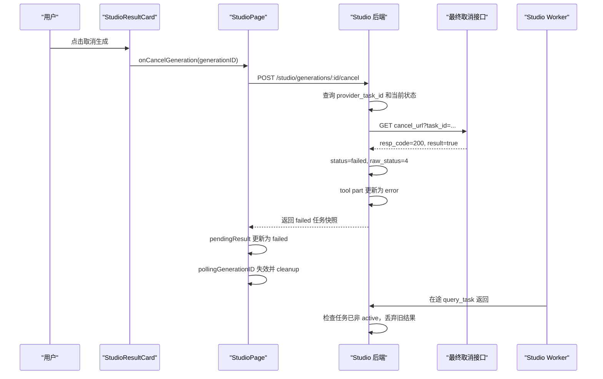

# Studio 取消生成实现方案

## 1. 目标

完善 `studio-result-cancel` 的取消生成能力：

- 按钮只在任务处于 `queued` 或 `running` 时显示。
- 点击后通过 Studio 后端调用最终取消接口。
- 最终取消接口使用 `GET`，通过查询参数传递 `task_id`。
- 最终接口返回 `resp_code === 200 && result === true` 时视为取消成功。
- 取消成功后将供应商任务原始状态记为 `4`，Studio 状态记为 `failed`。
- 原始状态 `3` 及其他异常状态仍表示任务异常失败，不表示用户取消。
- 停止前端状态轮询和后端供应商任务轮询。
- 将当前任务对应的对话工具状态完成为失败态。
- 保留“用户取消生成”错误信息，刷新页面后仍显示为失败任务。

本方案只描述实现方式，暂不修改代码。

## 2. 当前实现分析

### 2.1 前端按钮仍是展示占位

文件：

```text
packages/app/octoapp/pages/studio/studio-result-card.tsx
```

按钮目前位于 `generating()` 条件内，因此已经只会在 `queued` 和 `running` 状态下渲染，但按钮带有 `disabled`，也没有点击回调：

```tsx
<button type="button" class="studio-result-cancel" disabled>
  取消生成
</button>
```

### 2.2 卡片组件没有取消事件

当前事件传递链只有图片选择：

```text
StudioPage
  -> StudioConversation
    -> StudioResultCard
```

需要沿这条链新增：

```ts
onCancelGeneration: (generationID: string) => void
```

卡片只负责展示和触发事件，不应在小组件内部直接拼接后端地址或调用最终取消接口。

### 2.3 前端轮询由 generation ID 驱动

`studio-page.tsx` 中的轮询只在任务为 `queued/running` 时存在：

```ts
const pollingGenerationID = createMemo(() => {
  const active = pendingResult() ?? studioTurn()?.result
  if (!active || active.status !== "queued" && active.status !== "running") return
  if (!isStudioGenerationID(active.id)) return
  return active.id
})
```

取消成功后，只要把对应结果更新为：

```ts
{
  status: "failed",
  rawStatus: 4,
  error: "用户取消生成",
}
```

`pollingGenerationID` 就会变为 `undefined`，现有 effect cleanup 会：

- 设置 `stopped = true`。
- 中止当前状态查询请求。
- 清除下一次 `setTimeout`。

因此不需要再维护另一套前端轮询定时器。

### 2.4 后端已经持久化 provider task ID

表：

```text
packages/opencode/src/studio/studio-generation.sql.ts
```

已有字段：

```ts
provider_task_id: text()
status: "queued" | "running" | "succeeded" | "failed"
raw_status: text()
error: text()
next_poll_at: integer()
completed_at: integer()
```

最终取消接口需要的 `task_id` 应由后端通过 `generationID` 查询 `provider_task_id` 获得。前端不应直接信任或提交 `taskId`，避免取消错误任务。

### 2.5 后端 worker 存在取消竞态

后台 worker 每秒扫描一次 `queued/running` 任务，并调用供应商 `query_task`。

即使取消成功后把数据库状态改为 `failed`，仍可能存在一次已经发出的 `query_task`。它稍后返回时，当前代码可能继续：

- 更新进度。
- 将任务写回 `queued/running`。
- 甚至执行生成成功逻辑。

因此取消实现不能只改数据库状态，还必须让 worker 的旧响应失去写回资格。

## 3. 推荐架构

前端只调用 Studio 自身的取消接口，由后端负责：

1. 根据 `generationID` 查找任务。
2. 校验任务仍为 `queued/running`。
3. 读取可信的 `provider_task_id`。
4. 调用供应商最终取消接口。
5. 验证 `resp_code === 200 && result === true`。
6. 原子更新任务为失败态，原始状态为 `4`。
7. 将会话中的 running tool part 更新为 error。
8. 返回更新后的 Studio 任务快照。



## 4. API 设计

### 4.1 Studio 对前端接口

推荐新增：

```http
POST /studio/generations/:generationID/cancel
```

虽然供应商最终接口是 `GET`，但 Studio 取消操作会改变任务状态，Studio 自身接口使用 `POST` 更符合语义，也能避免浏览器或代理缓存误触发。

请求不需要前端传 `task_id`：

```http
POST /studio/generations/studio_gen_xxx/cancel
```

成功响应直接返回更新后的任务快照：

```json
{
  "id": "studio_gen_xxx",
  "sessionID": "ses_xxx",
  "status": "failed",
  "rawStatus": 4,
  "progress": 45,
  "images": [],
  "error": "用户取消生成",
  "completedAt": 1781320000000,
  "updatedAt": 1781320000000
}
```

保留取消前最后一次进度，不需要强制改成 `0` 或 `100`。失败态卡片本身不显示进度条。

### 4.2 供应商最终取消接口

在 `internel_image_generate.ts` 增加独立函数，例如：

```ts
cancelInternalGeneration(taskId: string)
```

调用形式：

```http
GET {cancelTaskUrl}?task_id={encodeURIComponent(taskId)}
```

建议增加配置：

```text
IMAGE_CANCEL_TASK_URL
```

并提供对应默认地址。当前需求没有给出取消接口的完整 URL，编码前需要将实际地址填入默认常量或运行环境变量，不能复用 `query_task` 地址进行猜测。

响应类型：

```ts
type CancelTaskResponse = {
  resp_code?: number
  resp_msg?: string
  result?: boolean
}
```

成功条件必须同时满足：

```ts
response.ok &&
json.resp_code === 200 &&
json.result === true
```

以下情况均视为取消请求失败：

- HTTP 非 2xx。
- 网络异常。
- 请求超时。
- 响应无法解析为 JSON。
- `resp_code !== 200`。
- `result !== true`。

取消接口失败时：

- 不修改原生成任务状态。
- 不停止正常轮询。
- 前端按钮恢复可点击。
- 控制台保留详细错误。
- 可在按钮附近或统一提示中显示“取消失败，请重试”。

取消请求本身不做自动重试，避免重复取消带来的不确定行为。

## 5. 后端实现

### 5.1 新增供应商取消函数

文件：

```text
packages/opencode/src/tool/internel_image_generate.ts
```

职责：

- 拼接 `task_id` 查询参数。
- 复用 `internalImageHeaders({ contentType: false })`。
- 设置独立超时，例如 `IMAGE_CANCEL_TIMEOUT_MS`，默认建议 `15_000`。
- 保留 HTTP 状态、响应体、业务码和网络异常，便于排查。
- 只返回明确的取消成功结果，不负责修改 Studio 数据库。

建议错误信息包含：

```text
cancel_task failed.
taskId=...
status=...
statusText=...
body=...
```

### 5.2 新增 Studio 服务方法

文件：

```text
packages/opencode/src/studio/studio-service.ts
```

新增：

```ts
cancelGeneration(generationID: string)
```

处理顺序：

1. 按 `generationID + Instance.directory` 查询记录。
2. 不存在时抛出 `Studio generation not found`。
3. 仅允许 `queued/running` 进入取消流程。
4. 校验 `provider === "internel"`。
5. 从 `provider_task_id` 获取最终 `task_id`。
6. 调用 `cancelInternalGeneration(provider_task_id)`。
7. 供应商确认成功后，事务内将任务落为失败。
8. 将对应会话 tool part 更新为 error。
9. 返回 `generationSnapshot`。

无 `provider_task_id` 时不能调用最终接口，应返回明确错误：

```text
Studio generation has no provider task id and cannot be cancelled.
```

当前内部供应商任务在创建 Studio 记录前已经获得 `task_id`，正常情况下不会缺失；校验仍必须保留。

### 5.3 取消成功后的持久化字段

建议统一写入：

```ts
{
  status: "failed",
  raw_status: "4",
  error: "用户取消生成",
  queue_order: null,
  next_poll_at: Number.MAX_SAFE_INTEGER,
  completed_at: now,
  time_updated: now,
}
```

不删除：

- `provider_task_id`
- 原请求参数
- 已有进度
- 已有供应商响应摘要

这样仍可追踪取消的是哪个供应商任务，以及取消发生前的进度。

### 5.4 会话工具状态

取消成功后需要复用或抽取现有失败落盘逻辑，将 running tool part 更新为：

```ts
state.status = "error"
state.error = "用户取消生成"
state.metadata.studio.status = "failed"
state.metadata.studio.rawStatus = 4
state.metadata.studio.progress = record.progress
state.time.end = now
```

这样：

- 当前页面立即显示失败对话。
- 刷新页面后 `buildStudioTurns()` 仍能从会话消息恢复失败态。
- 历史会话不会再次显示为工具运行中。

建议不要直接调用当前 `failGeneration(record, error)` 后再额外改 `raw_status`，因为它内部先更新数据库、再读取 running tool part，且没有表达“用户取消”的专用语义。更稳妥的是抽取一个共用的终止函数，接收：

```ts
{
  error: string
  rawStatus?: number | string
}
```

普通失败与用户取消都走同一套会话结束逻辑。

## 6. 并发与幂等处理

### 6.1 防止 worker 在途响应覆盖取消结果

这是实现中的关键点。

供应商 `query_task` 返回后，在执行以下任一操作前必须重新读取数据库当前状态：

- `updateStudioGenerationProgress`
- `completeGeneration`
- 写回 `queued/running`
- `failGeneration`

仅当数据库当前状态仍为 `queued/running` 时才允许继续处理。若已经是 `failed/succeeded`，立即丢弃当前查询结果。

数据库更新也建议增加状态条件：

```ts
where(
  and(
    eq(StudioGenerationTable.id, record.id),
    inArray(StudioGenerationTable.status, ["queued", "running"]),
  ),
)
```

不能只依赖 worker 开始处理时读取到的旧 `record.status`。

对成功完成逻辑尤其要先做 active 状态检查，再更新 tool part。否则取消后仍可能把会话工具状态改为完成。

### 6.2 取消接口幂等

建议规则：

| 当前状态 | 行为 |
| --- | --- |
| `queued/running` | 调用最终取消接口 |
| `failed` 且 `raw_status === "4"` | 直接返回当前快照，视为已取消 |
| `succeeded` | 返回冲突错误，不调用最终接口 |
| 其他 `failed` | 返回冲突错误，不覆盖原失败原因 |

这样双击按钮、请求响应丢失后重试，不会重复破坏任务状态。

### 6.3 同一任务只允许一个取消请求

前端需要 `cancellingGenerationIDs` 或单个 `cancellingGenerationID` 状态，在请求期间禁用当前按钮并显示：

```text
取消中...
```

后端仍需有并发保护。推荐先通过内存集合防止同进程重复请求，并以数据库状态条件作为最终保护。仅靠前端 disabled 不足以避免多窗口并发。

### 6.4 任务恰好完成时的处理

取消请求与任务完成可能同时发生。

推荐以“谁先将数据库从 active 状态原子更新到终态”为准：

- 取消先落库：worker 丢弃在途成功结果，任务最终为取消失败态。
- 成功先落库：取消接口返回任务已完成，不再调用或不再确认本地取消。

如果供应商取消成功，但本地任务已经被并发写为 succeeded，应记录警告并返回当前真实终态，不能把已经完成的会话强行覆盖为失败。

## 7. HttpApi 路由

涉及文件：

```text
packages/opencode/src/server/routes/instance/httpapi/groups/studio.ts
packages/opencode/src/server/routes/instance/httpapi/handlers/studio.ts
```

新增路径：

```ts
generationCancel: `${root}/generations/:generationID/cancel`
```

新增 endpoint：

```ts
HttpApiEndpoint.post("cancelGeneration", StudioPaths.generationCancel, {
  params: { generationID: Schema.String },
  success: described(StudioGenerationResult, "Cancelled Studio generation"),
  error: [HttpApiError.BadRequest, ApiStudioGenerationError],
})
```

handler 调用：

```ts
Instance.restore(instance, () => cancelGeneration(ctx.params.generationID))
```

错误继续通过 `ApiStudioGenerationError.data.message` 返回，确保前端能看到供应商 HTTP、业务码或网络失败详情。

## 8. 前端实现

### 8.1 组件事件传递

修改：

```text
packages/app/octoapp/pages/studio/studio-result-card.tsx
packages/app/octoapp/pages/studio/studio-conversation.tsx
packages/app/octoapp/pages/studio-page.tsx
```

`StudioResultCardProps` 增加：

```ts
onCancelGeneration: (generationID: string) => void
cancelling: boolean
```

按钮条件保持：

```ts
status() === "queued" || status() === "running"
```

并额外要求存在真实 generation ID：

```ts
props.turn.result && isStudioGenerationID(props.turn.result.id)
```

本地临时 ID `studio_pending_*` 阶段还没有可取消的后端任务，不显示按钮。创建接口返回真实 generation ID 后再显示。

按钮行为：

```tsx
<button
  type="button"
  class="studio-result-cancel"
  disabled={props.cancelling}
  onClick={() => props.turn.result && props.onCancelGeneration(props.turn.result.id)}
>
  {props.cancelling ? "取消中..." : "取消生成"}
</button>
```

### 8.2 前端取消请求

在 `studio-page.tsx` 增加：

```ts
cancelStudioGeneration(generationID: string)
```

请求：

```http
POST /studio/generations/:generationID/cancel
```

复用现有：

- server 地址。
- Authorization。
- `x-opencode-directory`。
- `formatStudioGenerationError()`。

### 8.3 取消成功后的状态更新

后端成功响应后：

```ts
setPendingResult((current) => {
  if (!current || current.id !== generation.id) return current
  return {
    ...generation,
    sourceImage: current.sourceImage,
  }
})
setStatus("failed")
```

不应在请求发出时就乐观改为失败。只有最终接口明确返回 `result: true` 且后端完成持久化后，才能展示取消成功。

更新为 `failed` 后，现有轮询自动清理，不需要手动调用 `clearTimeout`。

### 8.4 防止前端在途轮询回写

取消成功更新 `pendingResult.status` 后：

- `pollingGenerationID` 变为 `undefined`。
- 轮询 effect cleanup 设置 `stopped = true`。
- cleanup 中止当前 GET。
- 当前 `run()` 在请求返回后通过 `if (stopped) return` 丢弃旧响应。

现有轮询结构已经具备这一能力。实现时应保留这几个检查，不能为了取消功能改回 `setInterval`。

可额外维护已取消 ID 集合，作为防御性检查：

```ts
const cancelledGenerationIDs = new Set<string>()
```

但只要 effect cleanup 和后端状态保护完整，这不是必需状态。

### 8.5 取消失败

取消接口调用失败时：

- `console.error("[StudioPage] cancel generation failed", error)`。
- 不修改当前 `pendingResult.status`。
- 不停止轮询。
- 清除 `cancelling`，恢复按钮。
- 展示轻量错误提示，不把“取消失败”误认为“生成失败”。

生成任务此时仍可能正常完成。

## 9. 状态映射

供应商和 Studio 使用两层状态：

| 场景 | 供应商原始状态 `rawStatus` | Studio 状态 | 展示 |
| --- | --- | --- | --- |
| 排队 | `6` | `queued` | 排队中 |
| 生成中 | `0/1` | `running` | 生成中 |
| 成功 | `2` | `succeeded` | 生成完成 |
| 用户取消 | `4` | `failed` | 生成失败 |
| 任务异常 | `3` | `failed` | 生成失败 |
| 其他失败 | 除 `0/1/2/4/6` 外的值 | `failed` | 生成失败 |

不需要在公共 `StudioGenerationStatus` 中增加 `cancelled`。按照当前需求，取消任务就是一种 `failed` 任务，只通过：

```ts
rawStatus === 4
error === "用户取消生成"
```

区分失败原因。

## 10. 建议修改文件

```text
packages/opencode/src/tool/internel_image_generate.ts
  - 增加取消接口响应类型、URL 配置、超时和 cancelInternalGeneration()

packages/opencode/src/studio/studio-service.ts
  - 增加 cancelGeneration()
  - 取消成功后更新 generation 与 session tool part
  - worker 写回前重新校验 active 状态
  - 所有 worker 更新增加 queued/running 条件

packages/opencode/src/server/routes/instance/httpapi/groups/studio.ts
  - 增加 /studio/generations/:generationID/cancel

packages/opencode/src/server/routes/instance/httpapi/handlers/studio.ts
  - 增加 cancelGeneration handler

packages/app/octoapp/pages/studio-page.tsx
  - 增加取消请求、取消中状态和成功/失败处理

packages/app/octoapp/pages/studio/studio-conversation.tsx
  - 透传 onCancelGeneration 和 cancelling

packages/app/octoapp/pages/studio/studio-result-card.tsx
  - 只在真实 queued/running 任务显示按钮并触发取消

packages/app/octoapp/pages/studio/studio-03.css
  - 补充正常 hover、取消中 disabled 样式
```

本方案不需要数据库迁移，现有字段足以表达取消后的状态。

## 11. 测试方案

### 11.1 后端单元/集成测试

至少覆盖：

1. `queued` 任务取消成功，写入 `failed/raw_status=4`。
2. `running` 任务取消成功。
3. 供应商返回 `resp_code=200/result=true` 才成功。
4. `result=false` 时保持原状态并继续轮询。
5. HTTP 非 2xx 时保留详细错误且不改任务状态。
6. 无 `provider_task_id` 时拒绝取消。
7. 已取消任务重复取消直接返回当前快照。
8. 已成功任务不能取消。
9. 普通失败任务不能被改写成取消失败。
10. 取消成功后 `next_poll_at` 不再进入 worker 扫描范围。
11. 在途 `query_task` 晚于取消返回时不能覆盖 failed 状态。
12. 取消和成功并发时只有一个终态生效。
13. session tool part 从 running 更新为 error，并保存“用户取消生成”。

### 11.2 前端测试

至少覆盖：

1. `queued` 显示取消按钮。
2. `running` 显示取消按钮。
3. `submitting/succeeded/failed` 不显示取消按钮。
4. `studio_pending_*` 临时任务不显示取消按钮。
5. 点击后只发送一次取消请求。
6. 请求期间按钮 disabled，并显示“取消中...”。
7. 成功后卡片变为生成失败且进度条消失。
8. 成功后不再调用状态查询接口。
9. 取消失败后任务仍保持原状态并继续轮询。
10. 取消成功后的旧轮询响应不能覆盖失败状态。
11. 刷新会话后仍恢复为失败任务。

## 12. 验收标准

- 取消按钮只出现在真实的 `queued/running` 任务上。
- 点击取消只调用一次 Studio 取消接口。
- Studio 后端使用保存的 `provider_task_id` 调用最终 GET 取消接口。
- 最终接口只有在 `resp_code=200` 且 `result=true` 时才算取消成功。
- 取消成功后数据库为 `status=failed`、`raw_status=4`。
- 原始状态 `3` 和其他异常值仍按任务异常失败处理，不会被识别为用户取消。
- 卡片展示“生成失败”，不显示进度条和取消按钮。
- 前端不再请求该 generation 的状态接口。
- 后端 worker 不再轮询该任务。
- 已经在途的前后端查询响应都不能覆盖取消结果。
- 会话 tool part 完成为 error，刷新页面后状态不恢复为生成中。
- 取消失败不会误伤原生成任务，详细异常仍可用于分析。
