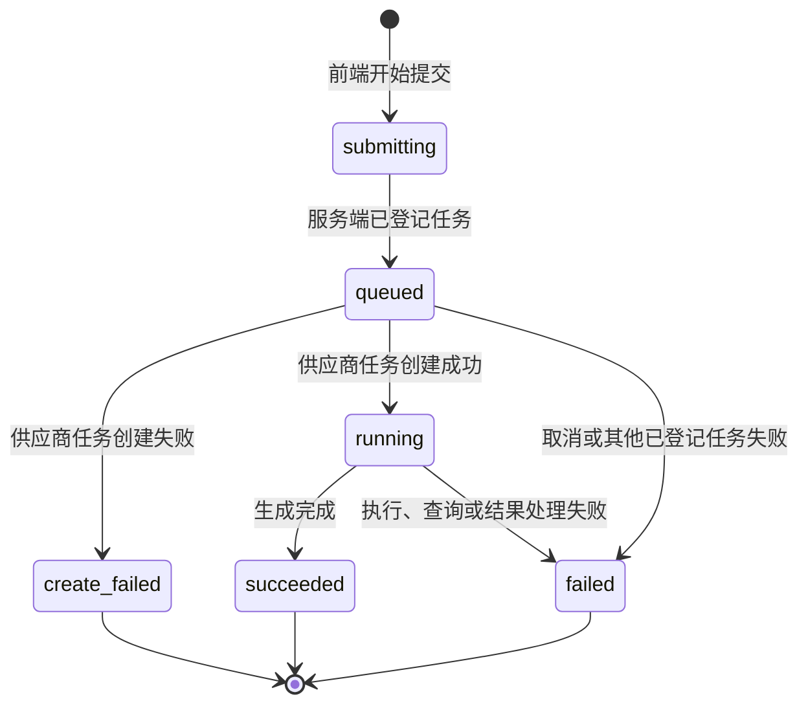
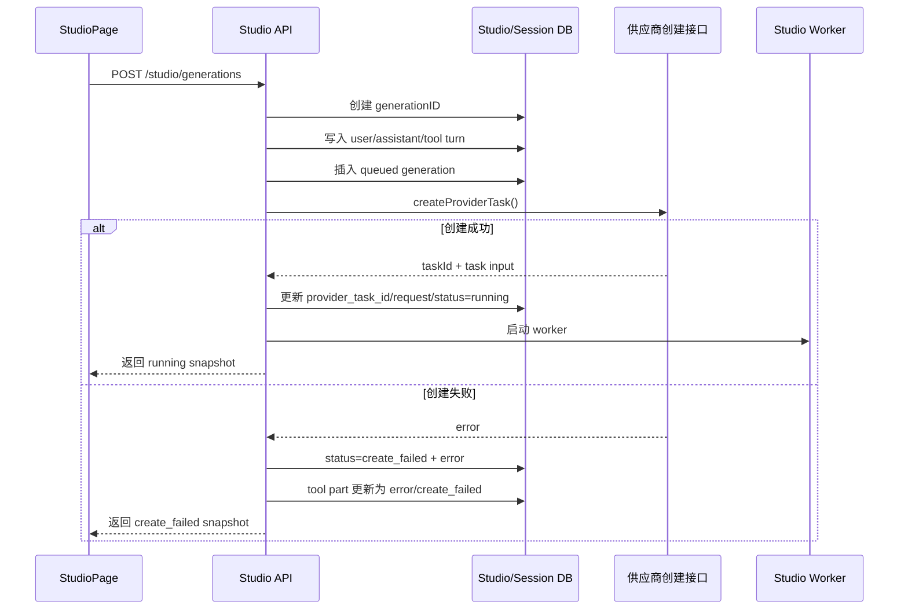

# Studio 任务“创建失败”状态实现方案

## 1. 背景

Studio 在新建空对话中发送生成任务时，当前流程会：

1. 创建一个 `octo_studio` session。
2. 跳转到新 session 路由。
3. 请求 `POST /studio/generations` 创建生成任务。
4. 服务端调用供应商的任务创建接口。
5. 供应商任务创建成功后，服务端才持久化 Studio 对话和 generation 记录。

如果第 4 步直接失败，服务端尚未写入用户消息、助手消息、工具 part 和
`studio_generation` 记录。前端只能把错误写入临时的 `pendingResult`。

与此同时，新 session 路由切换 effect 可能在请求失败后执行，并在
`sending()` 已经变为 `false` 时清空 `pendingResult`。最终表现为：

```text
提交中的对话短暂出现
  -> 创建任务请求失败
  -> 临时失败状态出现
  -> 路由 effect 清空临时状态
  -> 页面恢复为空的新建对话
```

现有 `failed` 状态表示任务已经创建，但在后续执行或查询阶段失败。它无法准确表达
“供应商任务根本没有创建成功”。

## 2. 目标

新增 Studio 正式终态：

```ts
"create_failed"
```

中文展示名称为：

```text
创建失败
```

实现后应满足：

1. 供应商任务创建失败时，Studio 对话仍然保留。
2. 页面立即展示“创建失败”卡片，而不是回到空白新建页。
3. 刷新页面、切换会话、重启应用后仍能恢复该失败记录。
4. `create_failed` 与执行阶段的 `failed` 明确区分。
5. 创建失败任务不进入 worker 轮询。
6. 创建失败任务不显示取消生成按钮和生成进度条。
7. 创建失败任务可以继续作为普通历史轮次展示。
8. 不破坏已有 `queued`、`running`、`succeeded`、`failed` 数据。
9. 修复新 session 路由切换清空当前 pending 状态的竞态。

## 3. 非目标

本次不处理：

- 自动重试供应商任务创建。
- 用户点击卡片直接重试。
- 修改供应商创建接口协议。
- 将浏览器完全无法连接本地服务的错误永久写入服务端。
- 合并 `create_failed` 与现有 `failed`。
- 修改其他非 Studio 会话的消息状态。

## 4. 状态定义

### 4.1 完整状态流



其中：

- `submitting` 仍然只属于前端瞬时状态。
- `queued` 表示 Studio 已经持久化任务，但供应商任务可能尚未创建完成。
- `create_failed` 表示供应商任务创建接口失败，没有可供后续查询的 provider task ID。
- `running` 表示供应商任务已创建，可以进入 worker 查询。
- `failed` 表示 Studio generation 已创建并进入正常任务生命周期，之后发生失败或被取消。

### 4.2 状态文案

| 状态 | 卡片文案 | 是否终态 | 是否轮询 | 是否可取消 |
| --- | --- | --- | --- | --- |
| `submitting` | 提交中 | 否 | 否 | 否 |
| `queued` | 排队中 / 生成中 | 否 | 是 | 视 task ID 而定 |
| `running` | 生成中 | 否 | 是 | 是 |
| `succeeded` | 生成完成 | 是 | 否 | 否 |
| `create_failed` | 创建失败 | 是 | 否 | 否 |
| `failed` | 生成失败 | 是 | 否 | 否 |

## 5. 总体实现

核心原则是先建立 Studio 自己可恢复的数据，再调用外部供应商。

调整后的创建流程：



`POST /studio/generations` 对可归类为供应商创建失败的情况不再抛出 HTTP 错误，
而是返回一个持久化后的 `create_failed` generation snapshot。

只有 Studio 自身无法登记任务时才返回非 2xx，例如：

- session 不存在。
- session 不属于当前目录。
- 请求参数校验失败。
- 本地数据库写入失败。

## 6. 服务端实现

### 6.1 扩展状态类型

文件：

```text
packages/opencode/src/studio/studio-generation.sql.ts
```

修改：

```ts
export type StudioGenerationStatus =
  | "queued"
  | "running"
  | "succeeded"
  | "create_failed"
  | "failed"
```

`status` 数据库字段当前是 SQLite `text()`，TypeScript union 的扩展不需要新增字段，
通常也不需要数据库迁移。

文件：

```text
packages/opencode/src/studio/studio-service.ts
```

`StudioGenerationResult.status` 会通过现有 `StudioGenerationStatus` 自动支持
`create_failed`。

### 6.2 调整 `createGeneration()` 执行顺序

当前关键顺序：

```ts
const task = await createProviderTask(input, provider)
const persistedInput = task?.input ?? input
const turn = persistStudioSession(...)
db.insert(StudioGenerationTable)...
```

应改为：

```ts
export async function createGeneration(input: StudioGenerationRequest) {
  const sessionID = SessionID.zod.parse(input.sessionID)
  const session = loadAndValidateSession(sessionID)
  const createdAt = Date.now()
  const id = Identifier.create("studio_gen", "ascending")
  const provider = resolveProvider(input)
  const turn = persistStudioSession({
    generationID: id,
    sessionID,
    request: input,
    provider,
    createdAt,
  })

  if (!turn) throw new Error(`Unable to create Studio session turn: ${sessionID}`)

  Database.use((db) =>
    db.insert(StudioGenerationTable).values({
      id,
      session_id: sessionID,
      directory: session.directory,
      assistant_message_id: turn.assistantInfo.id,
      tool_part_id: turn.toolPart.id,
      provider,
      capability: input.capability,
      status: "queued",
      progress: 0,
      request: { input },
      next_poll_at: Number.MAX_SAFE_INTEGER,
      time_created: createdAt,
      time_updated: createdAt,
    }).run(),
  )

  const task = await createProviderTask(input, provider).catch((error) => {
    failGenerationCreation({
      id,
      sessionID,
      turn,
      error,
    })
    return
  })

  if (!task && provider === "internel") {
    return getGeneration(id)
  }

  activateGeneration({
    id,
    input,
    task,
  })
  startStudioGenerationWorker()
  return getGeneration(id)
}
```

以上是结构示意。实际实现应继续遵守当前文件的类型和数据库访问方式，并避免为了
`loadAndValidateSession()` 等只调用一次的逻辑引入不必要函数。

### 6.3 queued 记录的 `next_poll_at`

在供应商任务创建完成前，不应允许 worker 扫描该记录。

初始插入建议使用：

```ts
next_poll_at: Number.MAX_SAFE_INTEGER
```

创建成功后原子更新为：

```ts
{
  status: "running",
  provider_task_id: task.taskId,
  request: stripUndefined({ input: task.input ?? input, task }),
  next_poll_at: Date.now(),
  time_updated: Date.now(),
}
```

这样即使 worker 已经启动，也不会把“正在创建供应商任务”的 generation 当作可查询任务。

### 6.4 创建失败持久化函数

建议新增与 `failGeneration()` 语义分离的内部函数：

```ts
function failGenerationCreation(input: {
  id: string
  sessionID: SessionID
  turn: StudioPersistedTurn
  error: unknown
}) {
  const message = input.error instanceof Error
    ? input.error.message
    : String(input.error)
  const completedAt = Date.now()

  Database.use((db) =>
    db
      .update(StudioGenerationTable)
      .set({
        status: "create_failed",
        error: message,
        completed_at: completedAt,
        next_poll_at: Number.MAX_SAFE_INTEGER,
        time_updated: completedAt,
      })
      .where(eq(StudioGenerationTable.id, input.id))
      .run(),
  )

  failStudioSession({
    sessionID: input.sessionID,
    turn: input.turn,
    error: input.error,
    studioStatus: "create_failed",
  })
}
```

不建议直接复用 `failGeneration()`：

- `failGeneration()` 面向已进入 worker 生命周期的任务。
- 它会重新从数据库读取 running tool part。
- 创建阶段已经持有 `turn`，无需再次读取。
- 单独函数能让创建失败和执行失败的语义保持清楚。

### 6.5 扩展 `failStudioSession()`

通用 SDK tool part 状态保持：

```ts
state.status = "error"
```

不扩展 `MessageV2.ToolState`。Studio 的细分状态写在 metadata：

```ts
metadata: {
  ...input.turn.toolPart.state.metadata,
  statusCode: 500,
  studio: {
    ...existingStudioMetadata,
    status: input.studioStatus ?? "failed",
  },
}
```

建议参数：

```ts
studioStatus?: Extract<StudioGenerationStatus, "create_failed" | "failed">
```

执行阶段原有调用不传该字段时，默认仍写 `"failed"`。

### 6.6 供应商创建接口错误码映射

供应商最终创建接口的响应中包含：

```ts
type CreateTaskResponse = {
  resp_code?: number
  resp_msg?: string
  result?: unknown
}
```

当创建接口返回失败时，应先将原始响应解析为面向用户的失败原因，再写入
`studio_generation.error` 和 session tool part 的 `state.error`。

当前需要支持以下映射：

| `resp_code` | 创建失败原因 |
| --- | --- |
| `5004` | 最多支持同时进行3个生成任务 |
| `5009` | 使用响应中的 `resp_msg` |
| 其他非 `200` | 任务创建失败，请检查网络或稍后再试 |

建议集中实现错误文案解析函数，避免服务端持久化、接口异常和前端展示分别维护映射：

```ts
function createTaskFailureMessage(response: CreateTaskResponse) {
  if (response.resp_code === 5004) {
    return "最多支持同时进行3个生成任务"
  }
  if (response.resp_code === 5009 && response.resp_msg?.trim()) {
    return response.resp_msg.trim()
  }
  if (response.resp_code !== 200) {
    return "任务创建失败，请检查网络或稍后再试"
  }
  return ""
}
```

`5009` 的 `resp_msg` 为空时应回退到通用文案，避免卡片出现空白错误原因：

```text
任务创建失败，请检查网络或稍后再试
```

除 `5004`、`5009` 外，其他所有非 `200` 响应都使用统一失败原因，不透传对应的
`resp_msg`：

```text
任务创建失败，请检查网络或稍后再试
```

供应商创建函数抛出的错误应携带解析后的文案。例如：

```ts
throw new Error(createTaskFailureMessage(response))
```

随后 `failGenerationCreation()` 直接持久化该错误文本，不再自行解析供应商响应：

```ts
{
  status: "create_failed",
  error: message,
}
```

前端不根据 `resp_code` 再做一次文案映射。这样刷新页面、切换会话和不同客户端看到的
失败原因一致，也避免前端依赖供应商原始响应结构。

### 6.7 `persistStudioSession()` 初始状态

初始 tool part 继续使用：

```ts
state.status = "running"
metadata.studio.status = "queued"
```

这样 session 事件到达前端时可以立即生成一张排队中的正式卡片。

如果供应商创建失败，紧接着再发出：

```text
message.updated
message.part.updated
```

将同一个 tool part 更新为 error，并把 Studio metadata 状态更新为
`create_failed`。

### 6.8 接口响应

供应商创建失败仍返回 generation snapshot，例如：

```json
{
  "id": "studio_gen_xxx",
  "sessionID": "ses_xxx",
  "status": "create_failed",
  "capability": "image.generate",
  "prompt": "生成一只小猫",
  "provider": "internel",
  "model": "seedream-5-lite",
  "aspectRatio": "3:4",
  "images": [],
  "progress": 0,
  "error": "最多支持同时进行3个生成任务",
  "createdAt": 1782200000000,
  "updatedAt": 1782200001000,
  "completedAt": 1782200001000
}
```

路由可以继续返回当前定义的 `202`。从 HTTP 语义看任务已被 Studio 接受并登记，
只是外部创建阶段结束为失败；前端依据 body 中的业务状态展示。

如果希望严格区分，也可以改为 `200`，但没有必要为本需求改变现有接口成功响应约定。

## 7. 前端实现

### 7.1 扩展前端状态类型

文件：

```text
packages/app/octoapp/pages/studio/types.ts
```

修改：

```ts
export type StudioGenerationStatus =
  | "idle"
  | "submitting"
  | "queued"
  | "running"
  | "succeeded"
  | "create_failed"
  | "failed"
```

`StudioGenerationResult.status` 仍排除：

```ts
"idle" | "submitting"
```

### 7.2 状态回退保护

文件：

```text
packages/app/octoapp/pages/studio/studio-shared.ts
```

更新 `isStudioGenerationStatusRegression()`：

```ts
export function isStudioGenerationStatusRegression(
  current: StudioGenerationResult["status"],
  next: StudioGenerationResult["status"],
) {
  return (
    current === "create_failed" ||
    current === "failed" ||
    current === "succeeded"
  ) && (
    next === "queued" ||
    next === "running"
  )
}
```

`create_failed` 是终态，不允许旧的 queued/running 事件覆盖它。

### 7.3 标题函数

扩展：

```ts
studioGenerationTitle(
  capability,
  status: "running" | "succeeded" | "create_failed" | "failed",
)
```

文案：

```ts
if (status === "create_failed") return `${label}创建失败`
if (status === "failed") return `${label}失败`
```

建议卡片主状态统一显示“创建失败”，工具标题按能力显示：

```text
图片创建失败
视频创建失败
```

### 7.4 从 session tool part 恢复状态

文件：

```text
packages/app/octoapp/pages/studio/turns.ts
```

当前 `studioProgress()` 只接受四种状态，需加入：

```ts
status === "create_failed"
```

建议将 error tool 的 Studio 状态单独读取：

```ts
const failure = studioProgress(errored)
const failureStatus =
  failure.status === "create_failed"
    ? "create_failed"
    : "failed"
```

构建结果时：

```ts
result: errored
  ? {
      ...,
      status: failureStatus,
      error: errored.state.error,
    }
  : undefined
```

工具标题：

```ts
errored
  ? failureStatus === "create_failed"
    ? capability === "video.generate"
      ? "视频创建失败"
      : "图片创建失败"
    : capability === "video.generate"
      ? "视频生成失败"
      : "图片生成失败"
  : undefined
```

这样刷新后会从持久化 tool metadata 中还原正确失败类型，而不是把所有 error tool
都解释成普通 `failed`。

### 7.5 `displayTurns()` 合并逻辑

文件：

```text
packages/app/octoapp/pages/studio-page.tsx
```

当前多处仅判断：

```ts
pending.status === "failed"
```

建议增加小型状态判断函数，避免分支遗漏：

```ts
function isStudioGenerationFailure(
  status: StudioGenerationResult["status"],
) {
  return status === "create_failed" || status === "failed"
}
```

以下逻辑都应同时识别两个失败终态：

- pending turn 与真实 turn 合并。
- tool title。
- tool name。
- pending 是否继续保留。
- `effectiveStatus()`。
- session idle 后的状态同步。

工具名称文案建议：

```text
内部 · 创建失败
内部 · 失败
```

### 7.6 结果卡片展示

文件：

```text
packages/app/octoapp/pages/studio/studio-result-card.tsx
```

不能再通过 `result.error` 直接把状态强制变成 `failed`：

```ts
if (props.turn.toolError || props.turn.result?.error) return "failed"
```

否则 `create_failed` 有 error 字段时会丢失业务状态。

推荐顺序：

```ts
const status = (): StudioGenerationStatus => {
  if (props.turn.result?.status === "create_failed") return "create_failed"
  if (props.turn.toolError || props.turn.result?.error) return "failed"
  if (props.turn.result?.images.length) return "succeeded"
  if (props.turn.result?.status) return props.turn.result.status
  if (props.busy || props.turn.toolRunning) return "running"
  return "failed"
}
```

状态文案：

```ts
if (status() === "create_failed") return "创建失败"
if (status() === "failed") return "生成失败"
```

CSS 可以继续复用：

```ts
failed: status() === "failed" || status() === "create_failed"
```

错误详情默认值：

```tsx
{props.turn.toolError ??
  props.turn.result?.error ??
  (status() === "create_failed" ? "任务创建失败，请检查网络或稍后再试" : "生成失败")}
```

创建失败卡片底部的失败原因直接使用服务端持久化的 `error`：

```text
resp_code = 5004
创建失败
最多支持同时进行3个生成任务
```

```text
resp_code = 5009
创建失败
{供应商响应中的 resp_msg}
```

```text
resp_code != 200，且不是 5004/5009
创建失败
任务创建失败，请检查网络或稍后再试
```

前端只负责展示，不应根据错误字符串或 `resp_code` 猜测失败类型。

### 7.7 空画布失败展示

文件：

```text
packages/app/octoapp/pages/studio/studio-conversation.tsx
```

当前空结果区域只区分 busy 与“生成失败”，需要增加：

```tsx
<div>
  {props.status === "create_failed" ? "创建失败" : "生成失败"}
</div>
```

### 7.8 busy、轮询和取消判断

以下逻辑不需要把 `create_failed` 当作 busy：

```ts
status === "queued" || status === "running" || status === "submitting"
```

前端轮询任务 ID 仍只允许：

```ts
queued | running
```

取消按钮仍只允许：

```ts
queued | running
```

因此 `create_failed` 会自然停止轮询并隐藏取消按钮。

## 8. 新 session 路由竞态修复

仅增加服务端持久化还不够。session 消息事件和重新加载存在延迟，如果路由 effect
先清空 pending，页面仍可能短暂恢复空白。

当前逻辑：

```ts
if (id && !sending()) {
  setStatus("idle")
  setPendingResult(undefined)
}
```

新建 generation 时已经设置：

```ts
pendingGenerationSessionID = sessionID
```

但 route effect 只用它保留 capability，没有完整保留 generation 状态。

建议调整为：

```ts
const preserveGeneration = Boolean(id && id === pendingGenerationSessionID)

if (preserveGeneration) {
  pendingGenerationSessionID = undefined
}

if (id && !sending() && !preserveGeneration) {
  setStatus("idle")
  setPendingResult(undefined)
}
```

注意：`pendingGenerationSessionID` 不能在计算完 `preserveGeneration` 之前清除。

更稳妥的方式是把 pending 与 session 显式绑定：

```ts
const [pendingGenerationSessionID, setPendingGenerationSessionID] =
  createSignal<string>()
```

在 `pendingResult` 增加 `sessionID` 后，可以直接判断：

```ts
const preserveGeneration =
  Boolean(id && pendingResult()?.sessionID === id)
```

当前类型已经允许 `StudioGenerationResult.sessionID?: string`，因此创建 session 后可以补写：

```ts
setPendingResult((current) =>
  current ? { ...current, sessionID } : current
)
```

推荐使用 `pendingResult.sessionID` 作为最终判断依据，临时变量仅用于路由尚未更新前的过渡。

## 9. 错误分类

### 9.1 应持久化为 `create_failed`

已经成功完成以下步骤：

- 请求进入 Studio 服务端。
- session 校验通过。
- Studio generation 和 session turn 已完成初始持久化。

之后发生的供应商创建错误，包括：

- create task 返回失败码。
- create task 返回非法响应。
- create task 没有 task ID。
- create task 请求超时。
- create task 网络错误。
- 构造供应商请求时抛出业务错误。

这些错误都应写为：

```ts
status: "create_failed"
```

其中创建接口业务错误的展示原因按以下规则持久化：

```text
resp_code=5004 -> 最多支持同时进行3个生成任务
resp_code=5009 -> resp_msg
其他非200      -> 任务创建失败，请检查网络或稍后再试
```

### 9.2 不应归类为 `create_failed`

以下情况 Studio 自己尚未接受任务：

- 请求参数校验失败。
- session ID 非法。
- session 不存在。
- session 目录不匹配。
- session turn 无法写入。
- generation 初始记录无法写入。

接口仍返回非 2xx。前端可以显示临时“创建失败”卡片，但这类记录无法通过当前接口永久保存。

### 9.3 请求完全没有到达服务端

例如：

- 本地 Studio 服务未启动。
- 浏览器到本地服务的连接被中断。
- fetch 在发出前被 abort。

服务端无法为该请求持久化记录。

前端 catch 中应将临时状态设为：

```ts
status: "create_failed"
```

并保留在当前页面，不能因为路由 effect 被清除。刷新后该条临时记录会消失，这是当前
单接口模型的边界。

如果未来要求此类错误也永久存在，需要改为两阶段接口：

```text
POST /studio/generations/register
POST /studio/generations/:id/start
```

或者由前端生成幂等 generation ID，重连后补登记。本次不建议扩大到该范围。

## 10. 兼容性

### 10.1 历史数据

历史记录只有：

```text
queued / running / succeeded / failed
```

扩展 union 后可以直接读取，不需要数据迁移。

### 10.2 老版本前端

如果老版本前端收到 `create_failed`：

- 运行时字符串不会导致 JSON 解析失败。
- 部分判断会把它落入默认失败分支。
- 但 TypeScript 编译期不涉及已发布客户端。

为了降低老版本显示异常风险，服务端 tool part 仍使用 `state.status = "error"`，
老前端至少会按普通失败展示。

### 10.3 SDK

本次 Studio 接口目前不是依赖生成 SDK 类型的核心链路。如果 OpenAPI schema 后续将
状态声明为 enum，需要同步重新生成 JavaScript SDK：

```bash
./packages/sdk/js/script/build.ts
```

只有 schema 或生成客户端类型实际变化时才执行。

## 11. 测试方案

### 11.1 服务端测试

建议为 `studio-service` 增加测试：

1. 供应商创建成功：
   - 先插入 queued 记录。
   - 最终状态为 running。
   - 保存 provider task ID。
   - session tool part 为 running。

2. 供应商创建失败：
   - `createGeneration()` 返回 snapshot，而不是抛出供应商错误。
   - snapshot 状态为 `create_failed`。
   - generation error 和 completed time 已保存。
   - session 中存在 user message。
   - session 中存在 assistant message。
   - tool part 为 error。
   - `metadata.studio.status` 为 `create_failed`。
   - provider task ID 为空。
   - worker 不会扫描该任务。

3. 供应商创建错误码：
   - `resp_code=5004` 时，generation 和 tool part 的 error 均为
     “最多支持同时进行3个生成任务”。
   - `resp_code=5009` 且 `resp_msg` 非空时，generation 和 tool part 的 error
     均为该 `resp_msg`。
   - `resp_code=5009` 且 `resp_msg` 为空时，使用
     “任务创建失败，请检查网络或稍后再试”。
   - 其他所有非 `200` 错误码统一使用
     “任务创建失败，请检查网络或稍后再试”，不透传 `resp_msg`。

4. Studio 自身持久化失败：
   - 接口仍返回错误。
   - 不产生不完整 generation 记录。

5. worker 扫描：
   - `create_failed` 不属于 active status。
   - 不调用 query task。

### 11.2 `turns.ts` 测试

在：

```text
packages/app/octoapp/pages/studio/turns.test.ts
```

增加：

1. error tool + `metadata.studio.status=create_failed`：
   - `result.status === "create_failed"`。
   - 图片能力标题为“图片创建失败”。
   - 视频能力标题为“视频创建失败”。
   - error 文本保留。

2. 普通 error tool：
   - 仍恢复为 `failed`。
   - 标题仍为“图片生成失败”或“视频生成失败”。

3. 状态回退保护：
   - `create_failed -> queued` 是回退。
   - `create_failed -> running` 是回退。

4. fallback result：
   - `create_failed` 显示“创建失败”。

### 11.3 组件与页面验证

手工验证：

1. 在 Studio 点击“新建对话”。
2. 输入生成内容。
3. 让供应商 create task 返回错误。
4. 页面保持在新 session。
5. 对话中显示用户消息和“创建失败”卡片。
6. 卡片不显示进度条。
7. 卡片不显示取消按钮。
8. 输入框恢复可提交。
9. 刷新页面后失败卡片仍存在。
10. 切换到其他会话再返回，失败卡片仍存在。
11. 同一会话继续发送新任务可以正常生成。
12. 普通运行期失败仍显示“生成失败”。

路由竞态验证：

1. 供应商 create task 立即失败。
2. 供应商 create task 延迟几十毫秒后失败。
3. 供应商 create task延迟到路由 effect 已完成后失败。
4. 三种时序都不得闪回空白新建页。

## 12. 实施顺序

建议按以下顺序实现：

1. 扩展服务端 `StudioGenerationStatus`。
2. 调整 `createGeneration()` 为先持久化后创建供应商任务。
3. 增加 `failGenerationCreation()`。
4. 扩展 `failStudioSession()` metadata 状态。
5. 确保 worker 不扫描未激活和 `create_failed` 任务。
6. 扩展前端状态类型和状态回退判断。
7. 更新 `turns.ts` 的持久化状态恢复。
8. 更新结果卡片和空画布文案。
9. 修复新 session 路由 effect 清理 pending 的竞态。
10. 增加服务端和前端测试。
11. 从 `packages/opencode` 运行相关测试和：

```bash
bun typecheck
```

测试不能从仓库根目录运行。

## 13. 验收标准

实现完成后，以下场景必须成立：

```text
新建空对话
  -> 发送生成任务
  -> 供应商任务创建失败
  -> 显示“创建失败”卡片
  -> 页面不返回空白新建态
  -> 刷新后记录仍存在
```

并且：

- 创建阶段失败使用 `create_failed`。
- 执行阶段失败继续使用 `failed`。
- `create_failed` 不参与轮询和取消。
- 同一 session 后续仍可继续发起任务。
- 历史 `failed` 数据展示不发生变化。
