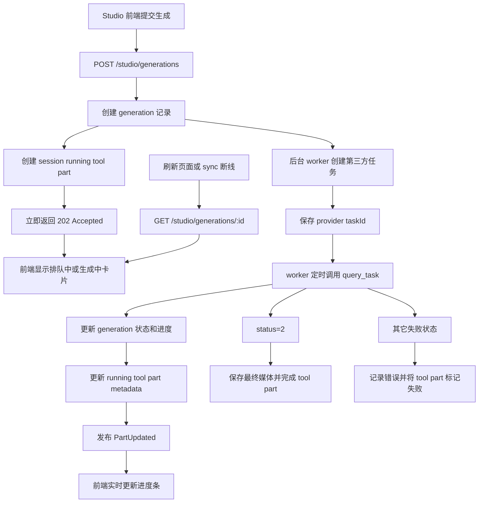

# Studio 生成结果卡片进度展示实现方案

## 目标

将 Studio 对话区里的 `studio-result-card` 生成中样式改成需求图形态：顶部展示“视频生成/图片生成”、生成状态、进度条、进度百分比和“取消生成”文案位，下方展示大块白色预览占位区。

本方案暂不实现：

- 顶部左侧图标的真实还原。
- “取消生成”的业务能力，包括中断请求、调用取消接口、状态回滚。
- 完成态结果缩略图样式的大改。

只实现：

- 根据接口返回 `status` 判断排队中、生成中、生成完成、生成失败。
- 根据接口返回 `progress` 展示进度条和百分比。
- 根据接口返回 `order` 展示排队人数。

## 当前现状

前端入口主要在 `packages/app/octoapp/pages/studio/index.tsx`。

- `StudioGenerationStatus` 当前只有 `"idle" | "submitting" | "running" | "succeeded" | "failed"`。
- `pendingResult` 在提交时本地创建，初始状态是 `running`，但没有 `progress/order/rawStatus` 字段。
- `createStudioGeneration()` 直接 `POST /studio/generations`，`await fetch()` 等到后端整次生成结束后才拿到 `StudioGenerationResult`。
- `StudioConversation` 中的 `studio-result-card` 当前在生成中展示 `.studio-generation-skeleton`，没有顶部状态条和进度条。
- `buildStudioTurns()` 只在工具 part 完成并解析到图片/视频时构造 `result`，running part 只通过 `toolRunning: true` 表示，没有结果级进度数据。

后端入口主要在：

- `packages/opencode/src/tool/internel_image_generate.ts`
- `packages/opencode/src/studio/studio-service.ts`
- `packages/opencode/src/server/routes/instance/httpapi/groups/studio.ts`
- `packages/opencode/src/studio/image-provider.ts`

当前后端已经能读到接口返回的状态字段：

- `getTaskStatus()` 从 `response.result.status`、`response.data.status`、`response.status`、`response.task_status`、`response.state` 中读取状态。
- `getTaskProgress()` 从 `response.result.progress`、`response.data.progress`、`response.progress` 中读取进度。
- `QueryTaskResponse.result.order` 类型已经存在。

但当前轮询逻辑只在最终成功时返回结果，或失败时抛错；中间轮询得到的 `status/progress/order` 不会同步给前端。因此如果只改 UI，不改数据传递，前端仍然只能展示本地假进度或一直是 0。

## 状态映射

接口状态映射建议集中成一个小函数，前后端语义保持一致：

| 接口 `status` | Studio 语义 | 展示文案 |
| --- | --- | --- |
| `0` | `running` | `生成中` |
| `1` | `running` | `生成中` |
| `2` | `succeeded` | `生成完成` |
| `6` | `queued` | `排队中` |
| 其它状态 | `failed` | `生成失败` |

前端现有 `StudioGenerationStatus` 没有 `queued`，建议扩展为：

```ts
export type StudioGenerationStatus = "idle" | "submitting" | "queued" | "running" | "succeeded" | "failed"
```

`StudioGenerationResult` 增加：

```ts
progress?: number
order?: number
rawStatus?: number | string
```

说明：

- `progress` 统一归一化到 `0-100`。
- `order` 仅排队态展示，文案可为 `排队中，前方 ${order} 人`。
- `rawStatus` 保留接口原始状态，方便排查和后续展示细分状态。

## 架构结论

不建议继续让前端等待 `/studio/generations` 直到生成完成。

当前请求由前端保持最长 180 秒，但实际生成可能超过 5 分钟。单纯把超时改成 10 分钟或更长仍然存在：

- 浏览器、桌面端、反向代理或网关提前断开。
- 页面刷新、切换会话后丢失请求上下文。
- 网络闪断被误判为生成失败，但第三方任务可能仍在执行。
- 一个 HTTP 请求长期占用连接和服务端处理上下文。
- 无法可靠恢复服务重启前尚未完成的任务。

推荐改成“持久化异步任务 + 后台 worker 轮询 + sync 实时通知 + GET 查询兜底”。

`POST /studio/generations` 只负责创建任务，完成任务落库和 running tool part 持久化后立即返回，不等待图片或视频生成完成。

## 推荐数据流



前端提交成功只代表“任务已被后端受理”，不代表生成已经完成。

## API 设计

### 1. 创建任务

```http
POST /studio/generations
202 Accepted
```

返回：

```ts
type StudioGenerationAccepted = {
  id: string
  sessionID: string
  status: "queued" | "running"
  progress: number
  order?: number
  createdAt: number
}
```

响应应在完成以下操作后立即返回：

1. 校验请求。
2. 创建 `studio_generation` 任务记录。
3. 创建 session user message、assistant message 和 running tool part。
4. 将任务加入后台执行队列或标记为待 worker 扫描。

第三方任务创建和后续轮询不应阻塞这个响应。

### 2. 查询任务

```http
GET /studio/generations/:generationId
200 OK
```

查询接口返回任务当前快照：

```ts
type StudioGenerationSnapshot = {
  id: string
  sessionID: string
  status: "queued" | "running" | "succeeded" | "failed"
  capability: StudioCapability
  prompt: string
  provider: "jimeng" | "internel"
  taskId?: string
  progress: number
  order?: number
  rawStatus?: number | string
  images: StudioImage[]
  error?: string
  createdAt: number
  updatedAt: number
  completedAt?: number
}
```

该接口主要用于：

- 页面刷新后恢复生成状态。
- sync 事件中断后的状态校准。
- 用户切换会话后重新进入。
- 前端长时间未收到事件时低频兜底查询。

前端不应直接轮询第三方 `query_task`。

### 3. 取消接口

取消功能本期不实现，但任务模型和路由应为后续能力保留：

```http
POST /studio/generations/:generationId/cancel
202 Accepted
```

本期界面中的“取消生成”保持不可操作。

## 任务持久化

正式方案不能只使用：

```ts
void runGenerationInBackground()
```

这种内存异步任务在服务进程退出、崩溃或重启后会丢失。建议新增 `studio_generation` 表，至少保存：

```text
id
session_id
assistant_message_id
tool_part_id
provider
provider_task_id
capability
status
raw_status
progress
queue_order
request
result
error
created_at
updated_at
completed_at
next_poll_at
poll_attempts
```

字段说明：

- `id`：Studio 自己的 generation ID，也是前端查询和未来取消操作的稳定标识。
- `provider_task_id`：第三方创建任务后返回的 task ID。
- `tool_part_id`：用于把任务进度同步到对应对话卡片。
- `status`：Studio 归一化状态。
- `raw_status`：第三方原始状态。
- `next_poll_at`：worker 下次轮询时间，避免所有任务同时轮询。
- `poll_attempts`：便于退避、监控和异常诊断。

请求参数和第三方响应建议使用结构化 JSON 字段；不要只依赖 session tool part 作为任务数据库。

## Worker 设计

worker 周期性领取满足以下条件的任务：

```text
status IN ("queued", "running")
AND next_poll_at <= now
```

每次处理：

1. 如果没有 `provider_task_id`，调用第三方创建任务接口并保存 task ID。
2. 调用第三方 `query_task`。
3. 读取并归一化 `status/progress/order`。
4. 更新 `studio_generation`。
5. 更新 session running tool part metadata。
6. 发布 `PartUpdated`。
7. 成功时保存图片或视频并完成 tool part。
8. 失败时记录错误并将 tool part 标记为 error。

需要避免同一任务被多个 worker 同时处理。可使用数据库事务、任务租约字段或原子状态更新实现领取。

服务启动后，worker 应继续扫描数据库里的 queued/running 任务，因此应用重启后可恢复轮询。

### 轮询频率

建议根据状态设置下一次轮询时间：

- `status=6` 排队中：3 至 5 秒。
- `status=0/1` 生成中：2 至 3 秒。
- 连续网络错误：指数退避，但设置最大间隔。
- `status=2` 或失败：停止轮询。

不要再使用固定 `maxPollCount=60` 作为任务最终超时依据。对于可能超过 5 分钟的任务，建议使用绝对截止时间，例如 30 分钟，并将超时配置化。

## 后端改造方案

### 1. 拆分“创建任务”和“执行任务”

位置：`packages/opencode/src/studio/studio-service.ts`

当前 `createGeneration()` 同时完成：

- 持久化对话。
- 调用第三方创建任务。
- 在函数内部轮询。
- 保存最终结果。
- 返回最终结果。

建议拆成：

```ts
createGeneration(input): Promise<StudioGenerationAccepted>
runGeneration(generationID): Promise<void>
pollGeneration(generationID): Promise<void>
getGeneration(generationID): Promise<StudioGenerationSnapshot>
```

`createGeneration()` 只创建本地任务和 running tool part，然后立即返回。

`runGeneration()` 和 `pollGeneration()` 由 worker 调用，不再绑定前端请求生命周期。

### 2. 拆分第三方创建和查询能力

位置：`packages/opencode/src/tool/internel_image_generate.ts`

当前 `executeInternelImageGenerate()` 内部包含创建任务和完整轮询。异步架构下应拆成可独立恢复的操作：

```ts
createInternalGeneration(input): Promise<{
  taskId: string
  request: unknown
  response: unknown
}>

queryInternalGeneration(taskId: string): Promise<{
  status: "queued" | "running" | "succeeded" | "failed"
  rawStatus: number | string
  progress: number
  order?: number
  images: GeneratedMedia[]
  response: unknown
}>
```

拆分后，worker 可以仅根据数据库里的 `provider_task_id` 恢复查询，不需要保留原始函数调用栈。

需要补充：

- `getTaskOrder(response)`：从 `response.result?.order` 和 `response.data?.order` 读取。
- `normalizeProgress(progress)`：确保是有限数字，并限制在 `0-100`。
- `normalizeStudioTaskStatus(status)`：按 `0/1/2/6/其它` 映射。

### 3. 扩展 provider 输出类型

位置：`packages/opencode/src/studio/image-provider.ts`

给 `ImageGenerateOutput` 增加最终状态字段：

```ts
progress?: number
order?: number
rawStatus?: number | string
```

异步任务建议进一步把 provider contract 拆分为 `create/query`，不要只通过一次 `generate()` 暴露完整长流程。

### 4. 更新 running tool part

位置：`packages/opencode/src/studio/studio-service.ts`

新增 `updateStudioGenerationProgress()`，输入包括 generation 记录和最新状态。

它更新当前 running tool part 的 `state.metadata`，建议结构：

```ts
metadata: {
  ...existingMetadata,
  studio: {
    status: "queued" | "running" | "succeeded" | "failed",
    rawStatus,
    progress,
    order,
    response,
  },
}
```

也可以直接平铺为 `metadata.studioStatus`、`metadata.progress`、`metadata.order`，但 `metadata.studio` 更不容易和其它工具元数据冲突。

调用 `SyncEvent.run(MessageV2.Event.PartUpdated, ...)` 时要确保事件能被前端收到。当前相关持久化调用使用了 `{ publish: false }`，需要确认其语义；如果它阻止广播，进度更新必须发布到 sync。

完成态 `completeStudioSession()` 写入 output/metadata 时也带上最终字段：

```ts
progress: input.result.progress,
order: input.result.order,
rawStatus: input.result.rawStatus,
```

失败态 `failStudioSession()` 的 metadata 也建议保留：

```ts
metadata: {
  statusCode: 500,
  studio: {
    status: "failed",
    progress: lastProgress,
    order: lastOrder,
    rawStatus: lastRawStatus,
  },
}
```

### 5. 扩展 HTTP API schema 和 SDK

位置：`packages/opencode/src/server/routes/instance/httpapi/groups/studio.ts`

新增创建响应和任务快照 schema。任务状态至少包含：

```ts
status: Schema.Union([
  Schema.Literal("running"),
  Schema.Literal("queued"),
  Schema.Literal("succeeded"),
  Schema.Literal("failed"),
])
```

新增：

```ts
progress: Schema.optional(Schema.Number),
order: Schema.optional(Schema.Number),
rawStatus: Schema.optional(Schema.Union([Schema.Number, Schema.String])),
```

新增 GET 路由：

```ts
HttpApiEndpoint.get("getGeneration", `${StudioPaths.generations}/:generationID`, {
  success: StudioGenerationSnapshot,
})
```

如果修改了 HTTP schema，按仓库说明需要重新生成 JS SDK：

```bash
./packages/sdk/js/script/build.ts
```

## 前端改造方案

### 1. 扩展类型

位置：`packages/app/octoapp/pages/studio/types.ts`

更新 `StudioGenerationStatus`，并给 `StudioGenerationResult` 增加：

```ts
progress?: number
order?: number
rawStatus?: number | string
```

### 2. 解析 running part 的进度

位置：`packages/app/octoapp/pages/studio/turns.ts`

当前 `buildResult()` 对 running part 只设置 `toolRunning`。需要从 `running.state.metadata.studio` 读取：

```ts
const runningOutput = studioProgressFromMetadata(running?.state.metadata)
```

当没有 completed media、但存在 running part 时，也构造一个 `result`：

```ts
result: running
  ? {
      id: `studio_${running.id}`,
      status: runningOutput.status,
      capability,
      prompt: extractUserDemand(input.userText),
      provider: resolveProvider(running.tool),
      toolAction: stringField(inputRecord, "toolAction") as StudioGenerationResult["toolAction"],
      taskId: stringField(inputRecord, "taskId"),
      model,
      aspectRatio,
      images: [],
      progress: runningOutput.progress,
      order: runningOutput.order,
      rawStatus: runningOutput.rawStatus,
      createdAt: input.createdAt,
    }
  : undefined
```

排队态标题：

- `video.generate` + queued：`视频排队中`
- `image.generate` + queued：`图片排队中`

生成态标题：

- `video.generate` + running：`视频生成中`
- `image.generate` + running：`图片生成中`

### 3. 提交后立即进入异步任务态

位置：`packages/app/octoapp/pages/studio/index.tsx`

`createStudioGeneration()` 不再等待最终媒体结果，而是接收 `StudioGenerationAccepted`。

`runGeneration()` 的状态变化调整为：

```text
提交前：idle
正在创建任务：submitting
收到 202：queued/running
收到 sync 或 GET 快照：queued/running/succeeded/failed
```

收到 202 后立即：

```ts
setPendingResult({
  ...accepted,
  capability: nextCapability,
  prompt: text,
  provider: "internel",
  model: styleModelLabel(styleModel()),
  aspectRatio: aspectRatio(),
  images: [],
})
setStatus(accepted.status)
setSending(false)
```

此时 `sending` 只表示“创建本地异步任务的请求尚未返回”，不能覆盖整个生成周期。任务是否仍在执行由 `pendingResult.status` 或 session running tool part 判断。

移除 `STUDIO_GENERATION_TIMEOUT_MS = 180_000` 对完整生成流程的约束。创建任务接口仍可设置较短网络超时，例如 10 至 30 秒，因为它只执行校验和持久化，不等待第三方生成完成。

如果 session running part 已通过 sync 到达，`displayTurns()` 应优先使用 running part 的 `result.progress/order/status` 覆盖本地 pending。

注意 `effectiveStatus()` 要把 queued 视为忙碌态：

```ts
if (result()?.status === "queued") return "queued"
```

并在禁用输入、按钮 loading 等判断中把 `queued` 和 `running` 一样处理。

### 4. 增加状态恢复和查询兜底

位置：`packages/app/octoapp/pages/studio/index.tsx`

正常情况下，前端通过现有 session sync 接收 `PartUpdated` 更新进度。

以下情况调用 `GET /studio/generations/:id`：

- 页面初始化时发现最新 tool part 仍是 running，并且 metadata 中存在 generation ID。
- sync 连接恢复后进行一次状态校准。
- queued/running 状态超过一段时间没有收到更新。
- 用户重新进入含未完成任务的 Studio 会话。

兜底查询应低频执行，例如 5 至 10 秒一次，不应复制后端对第三方接口的高频轮询。

当查询返回：

- `queued/running`：更新 pending result 和进度卡。
- `succeeded`：刷新 session messages，展示最终媒体并停止查询。
- `failed`：展示错误并停止查询。

组件卸载、切换会话或任务进入终态时清理定时器。

### 5. 将完整 `studio-result-card` 提取为独立组件

新增文件：

```text
packages/app/octoapp/pages/studio/studio-result-card.tsx
```

采用完整卡片组件方案，不只提取进度条。该组件统一负责：

- queued 排队态。
- running 生成态。
- succeeded 图片或视频结果态。
- failed 错误态。
- 卡片标题、创建时间、进度条、排队人数、结果缩略图和错误信息。
- 用户点击结果缩略图后的回调。

`StudioConversation` 继续留在 `index.tsx`，但只负责：

- 遍历 `turns`。
- 展示用户气泡和 assistant 文案。
- 判断是否为编辑器入口。
- 将当前 turn 数据传给 `StudioResultCard`。

组件 props 建议保持业务语义完整，不要把大量零散字符串和布尔值从父组件传入：

```tsx
import type { StudioCapability } from "./types"
import type { StudioTurnData } from "./turns"

export function StudioResultCard(props: {
  turn: StudioTurnData
  fallbackCapability?: StudioCapability
  busy: boolean
  onSelectImage: (input: { resultID: string; imageID: string }) => void
}) {
  // ...
}
```

其中：

- `turn` 是卡片的主要数据源。
- `fallbackCapability` 仅在 pending turn 尚未带 capability 时兜底。
- `busy` 仅兼容任务刚提交、running part 尚未同步到前端的短暂状态。
- `onSelectImage` 只负责通知父组件切换右侧工作区结果。

不要把 session、SDK、路由、worker 查询或 pending signal 传入卡片组件。卡片保持纯展示组件，所有异步任务状态都先归一化到 `StudioTurnData` / `StudioGenerationResult`。

### 6. 组件内部状态派生

位置：`packages/app/octoapp/pages/studio/studio-result-card.tsx`

组件内部集中派生状态：

```tsx
const capability = () =>
  props.turn.result?.capability ??
  props.fallbackCapability ??
  "image.generate"

const status = (): StudioGenerationStatus => {
  if (props.turn.toolError || props.turn.result?.error) return "failed"
  if (props.turn.result?.images.length) return "succeeded"
  if (props.turn.result?.status) return props.turn.result.status
  if (props.busy || props.turn.toolRunning) return "running"
  return "failed"
}

const progress = () => Math.min(100, Math.max(0, props.turn.result?.progress ?? 0))
const generating = () => status() === "queued" || status() === "running"
```

状态文案也在组件内统一处理：

```tsx
const mediaLabel = () => capability() === "video.generate" ? "视频生成" : "图片生成"

const statusLabel = () => {
  if (status() === "queued") {
    return props.turn.result?.order === undefined
      ? "排队中"
      : `排队中，前方 ${props.turn.result.order} 人`
  }
  if (status() === "running") return "生成中"
  if (status() === "succeeded") return "生成完成"
  return "生成失败"
}
```

组件不直接解析接口原始 `status=0/1/2/6`。原始状态映射必须在后端或 `turns.ts` 完成，组件只接收统一的 Studio 状态。

### 7. 组件结构

`StudioResultCard` 根据状态渲染两个主要分支：

```tsx
export function StudioResultCard(props: StudioResultCardProps) {
  return (
    <div
      class="studio-result-card"
      classList={{
        generating: generating(),
        complete: status() === "succeeded",
        failed: status() === "failed",
      }}
    >
      <Show when={generating()} fallback={<StudioResultCardContent />}>
        <StudioResultCardProgress />
      </Show>
    </div>
  )
}
```

这里的 `StudioResultCardProgress` 和 `StudioResultCardContent` 建议作为同文件内的局部函数，不再继续拆文件。它们只服务于一个卡片，单独拆分会增加跳转成本。

生成中分支：

```tsx
function StudioResultCardProgress(props: {
  capability: StudioCapability
  status: "queued" | "running"
  progress: number
  order?: number
}) {
  const label = () => props.capability === "video.generate" ? "视频生成" : "图片生成"
  const statusText = () =>
    props.status === "queued"
      ? props.order === undefined ? "排队中" : `排队中，前方 ${props.order} 人`
      : "生成中"

  return (
    <>
      <div class="studio-result-progress-header">
        <div class="studio-result-progress-title">
          <span class="studio-result-progress-icon" />
          <span>{label()}</span>
        </div>
        <span class="studio-result-progress-status">{statusText()}</span>
        <div
          class="studio-result-progress-track"
          role="progressbar"
          aria-label={`${label()}${statusText()}`}
          aria-valuemin="0"
          aria-valuemax="100"
          aria-valuenow={props.progress}
        >
          <div class="studio-result-progress-fill" style={{ width: `${props.progress}%` }} />
        </div>
        <span class="studio-result-progress-percent">{props.progress}%</span>
        <button type="button" class="studio-result-cancel" disabled>
          取消生成
        </button>
      </div>
      <div class="studio-result-progress-preview" />
    </>
  )
}
```

`取消生成` 本期保留 disabled button；组件不暴露 `onCancel`，等取消能力真正实现时再扩展 props。

完成/失败分支 `StudioResultCardContent` 迁移当前 `StudioConversation` 中已有的：

- `.studio-result-badge`
- `.studio-result-title`
- `.studio-result-meta`
- `.studio-result-error`
- `.studio-result-grid`
- `StudioMediaPreview`

完成态缩略图点击时调用：

```tsx
props.onSelectImage({
  resultID: props.turn.result.id,
  imageID: image.id,
})
```

### 8. `StudioConversation` 接入方式

位置：`packages/app/octoapp/pages/studio/index.tsx`

引入组件：

```tsx
import { StudioResultCard } from "./studio-result-card"
```

将当前从 `<div class="studio-result-card">` 到卡片闭合标签的整段 JSX 移出 `index.tsx`，替换为：

```tsx
<Show when={!turn.editCapability}>
  <StudioResultCard
    turn={turn}
    fallbackCapability={props.result?.capability}
    busy={props.busy && turn.isLatest}
    onSelectImage={props.onSelectImage}
  />
</Show>
```

只有最新一轮允许使用全局 `busy` 兜底，避免历史无结果轮次被错误显示成生成中。`StudioResultCard` 内仍可读取 `turn.toolRunning` 和 `turn.result.status` 判断自身状态。

提取后，以下展示函数如果只被结果卡片使用，也应一起移动到 `studio-result-card.tsx`：

- `studioGenerationTitle`
- 结果卡片需要的时间格式化辅助函数，或仅导入已有通用 `formatTime`
- 结果卡片专用的状态判断函数

`capabilityLabel`、`StudioMediaPreview` 如果仍被 `index.tsx` 其它区域使用，则继续从原位置导入或保留共享实现，不为组件复制逻辑。

### 9. CSS 样式建议

位置：`packages/app/octoapp/pages/studio/studio.css`

保留 `.studio-result-card` class，但生成态改成需求图风格：

```css
.studio-result-card.generating {
  min-height: 288px;
  padding: 16px 20px 22px;
  border: 1px solid rgba(15, 23, 42, 0.12);
  border-radius: 14px;
  background: linear-gradient(90deg, #eef4ff 0%, #ffffff 100%);
}

.studio-result-progress-header {
  display: grid;
  grid-template-columns: max-content max-content minmax(120px, 1fr) 48px max-content;
  align-items: center;
  gap: 20px;
}

.studio-result-progress-title {
  display: inline-flex;
  align-items: center;
  gap: 8px;
  min-width: 0;
  color: #191919;
  font-size: 20px;
  font-weight: 750;
  line-height: 28px;
}

.studio-result-progress-status {
  padding: 3px 10px;
  border-radius: 6px;
  background: rgba(97, 91, 255, 0.08);
  color: #615bff;
  font-size: 16px;
  font-weight: 700;
  line-height: 24px;
  white-space: nowrap;
}

.studio-result-progress-track {
  height: 8px;
  overflow: hidden;
  border-radius: 999px;
  background: rgba(15, 23, 42, 0.1);
}

.studio-result-progress-fill {
  height: 100%;
  border-radius: inherit;
  background: #191919;
  transition: width 240ms ease;
}

.studio-result-progress-percent {
  color: #191919;
  font-size: 20px;
  line-height: 28px;
  text-align: right;
  white-space: nowrap;
}

.studio-result-cancel {
  border: 0;
  background: transparent;
  color: #191919;
  font-size: 18px;
  line-height: 28px;
  white-space: nowrap;
}

.studio-result-progress-preview {
  height: 456px;
  margin-top: 22px;
  border-radius: 14px;
  background: #fff;
}
```

实际高度需要结合对话栏宽度调整。需求图像是 970x578，Studio 中间列当前宽度约 468px，不能照搬 456px 高度，否则对话卡可能过长。建议按容器宽度使用响应式：

```css
.studio-result-progress-preview {
  aspect-ratio: 16 / 9;
  min-height: 180px;
}
```

如果视频生成卡片希望更接近图中大面积留白，可以在中间列允许更宽时用 `min-height: 260px`。

移动/窄列样式：

```css
@media (max-width: 720px) {
  .studio-result-progress-header {
    grid-template-columns: 1fr auto;
    gap: 10px 12px;
  }

  .studio-result-progress-track {
    grid-column: 1 / -1;
  }

  .studio-result-progress-percent {
    grid-column: 1;
    text-align: left;
  }

  .studio-result-cancel {
    grid-column: 2;
  }
}
```

## 失败态处理

接口返回除 `0/1/2/6` 以外状态时：

- worker 应把 generation 记录更新为 `failed`，保存原始状态和错误信息。
- 后端同时将对应 session tool part 更新为 error 并发布事件。
- 前端卡片展示现有 `.failed` 错误区域，不展示进度条，或展示停在最后进度的失败条。首期建议沿用现有失败样式，避免和需求图混淆。

## 排队态展示

当 `status === 6`：

- `StudioGenerationResult.status = "queued"`。
- 进度条显示 `progress`。如果后端没有给 progress，展示 `0%`。
- 状态 badge 文案优先展示 `排队中，前方 ${order} 人`。
- 卡片仍属于 `.generating`，保持同一套视觉。

## 需要注意的坑

1. POST 返回成功不等于生成成功  
   `202 Accepted` 只表示任务已创建。前端不能在收到创建响应后调用 `setStatus("succeeded")`。

2. 不能只用进程内后台 Promise  
   `void runGenerationInBackground()` 在服务重启后无法恢复。正式方案必须持久化 generation 和 provider task ID。

3. `publish: false` 可能阻止实时同步  
   `studio-service.ts` 当前持久化 part 时使用 `{ publish: false }`。进度更新如果也不发布，前端只能最终刷新后看到，进度条不会动。

4. running part 也要构造 result  
   现在 `turns.ts` 只有 completed media 才有 `result`，这会导致 UI 难以读取 `progress/order`。需要让 running part 也产生一个 `images: []` 的 result。

5. queued 要纳入 busy 判断  
   否则排队时输入框、再次生成、编辑入口可能提前恢复可操作。

6. sync 不能作为唯一状态源  
   页面刷新、事件丢失或临时断线时必须能通过 `GET /studio/generations/:id` 恢复。

7. worker 要防止重复领取  
   多实例或定时扫描并发时，必须确保同一 generation 同一时间只有一个 worker 调用第三方查询。

8. SDK 需要重新生成  
   修改 `packages/opencode/src/server/routes/instance/httpapi/groups/studio.ts` 后，需要按仓库说明执行 `./packages/sdk/js/script/build.ts`。

## 验证建议

从包目录运行类型检查，避免触发根目录测试保护：

```bash
cd packages/opencode
bun typecheck
```

```bash
cd packages/app
bun typecheck
```

建议补充或更新测试：

- `packages/app/octoapp/pages/studio/turns.test.ts`
  - running part metadata 中 `status=running/progress=45` 时，构造 `result.status === "running"` 且 `progress === 45`。
  - running part metadata 中 `status=queued/order=3` 时，构造 `result.status === "queued"` 且 `order === 3`。
  - completed output 中带 `progress/rawStatus` 时，能恢复到最终 result。
- Studio service 测试
  - POST 创建任务后立即返回 accepted，不等待 provider 完成。
  - generation 记录和 running tool part 在同一次创建流程中完成。
  - worker 能从只有 provider task ID 的数据库记录恢复查询。
  - worker 收到成功、失败和排队状态时正确更新数据库与 tool part。
  - 重复 worker 领取不会重复执行同一任务。
- 前端任务恢复测试
  - 收到 202 后退出 submitting，并进入 queued/running。
  - sync 事件缺失时 GET 快照能更新进度。
  - succeeded/failed 后停止兜底查询。
- `StudioResultCard` 组件测试
  - queued 状态展示排队人数、0% 或接口进度。
  - running 状态展示进度条和百分比。
  - progress 小于 0 或大于 100 时被限制到 `0-100`。
  - succeeded 状态展示媒体缩略图并触发 `onSelectImage`。
  - failed 状态展示 tool error 或 result error。
  - 历史轮次不会因为页面全局 busy 被误判为 generating。

手动验证：

- 创建任务接口在第三方任务未完成时快速返回 202。
- 模拟 `status=6, order=5, progress=0`：卡片展示排队中和排队人数。
- 模拟 `status=1, progress=45`：卡片展示生成中、45%、进度条宽度 45%。
- 模拟 `status=2, progress=100`：卡片切到完成态并展示视频/图片结果。
- 模拟其它状态：卡片切失败态，错误信息展示。
- 生成超过 5 分钟时前端没有请求超时。
- 生成过程中刷新页面，任务状态和进度能够恢复。
- 生成过程中重启服务，worker 能继续查询已保存的 provider task ID。

## 建议实施顺序

1. 增加 `studio_generation` 持久化表和数据访问方法。
2. 把第三方能力拆为 create/query 两个可独立调用的方法。
3. 实现 worker 领取、轮询、状态更新和服务重启恢复。
4. 将 `POST /studio/generations` 改为创建任务后立即返回 202。
5. 增加 `GET /studio/generations/:generationID` 查询接口。
6. 把 generation 进度写入 running tool part metadata，并确认 sync event 能实时发布。
7. 扩展前后端状态、进度和排队字段类型。
8. 在 `turns.ts` 解析 running progress，构造 running/queued result。
9. 修改 `index.tsx` 的提交状态机，并增加 GET 查询兜底。
10. 新建 `studio-result-card.tsx`，迁移完整结果卡片的 queued/running/succeeded/failed 渲染。
11. 精简 `StudioConversation`，只保留对话编排并接入 `StudioResultCard`。
12. 增加结果卡片 CSS 响应式样式和组件测试。
13. 重新生成 JS SDK，并从包目录运行 typecheck 和相关测试。

## 分阶段落地

### 第一阶段：解决 180 秒长请求

- POST 创建任务后立即返回。
- 后端在当前进程启动轮询任务。
- 通过 tool part 和 sync 更新进度。
- 增加 GET 查询兜底。

这一阶段可以快速解决前端请求超时，但服务重启后后台任务仍可能丢失，只适合作为短期过渡。

### 第二阶段：完整可靠方案

- 增加 `studio_generation` 持久化表。
- 增加可恢复 worker。
- 保存 provider task ID、轮询状态和下次执行时间。
- 实现并发领取保护、失败退避和启动恢复。

如果允许一次完成，建议直接实施第二阶段，避免短期方案形成新的历史负担。
